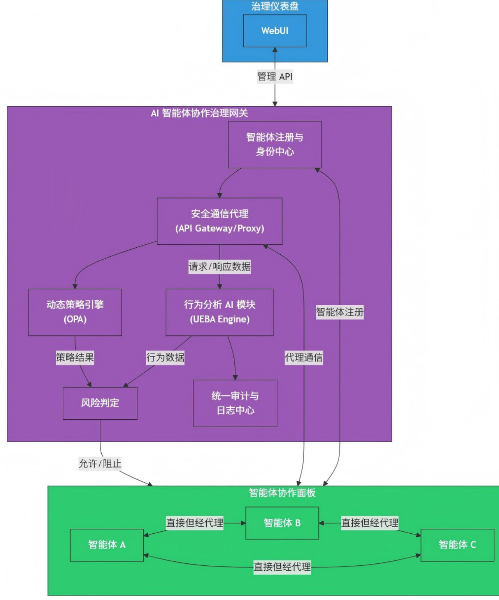

# AI 智能体协作治理网关 (AI Agent Governance Gateway) 项目方案

# 1. 项目愿景与目标

愿景： 构建一个安全、透明、可控的智能体协作生态。在不扼杀创新的前提下，实现对企业内所有 AI 智能体之间交互的“无感监管”与“智能审计”，确保智能体协作在预设的安全与合规框架内高效运行。

# 核心目标：

● 交互可视化： 清晰展现智能体间的调用关系、通信频率和数据流向。  
● 行为可审计： 为每一次交互提供不可抵赖的、标准化的日志记录，满足合规与追溯要求。  
● 风险可预警： 智能识别异常行为模式（如数据泄露、权限滥用、恶意攻击），并及时预警或阻断。  
● 策略可配置： 允许治理人员通过灵活的策略配置，定义交互的安全边界。

# 2. 核心设计原则

● 治理与业务分离： 网关只负责治理与安全，不参与具体的业务逻辑处理。  
● 对开发者友好： 智能体的开发者应能以最小的改动接入治理体系，遵循标准协议（如 A2A/MCP）即可。  
● 性能无损优先： 网关的设计应最大限度减少对正常通信的性能影响，避免成为瓶颈。  
$\cdot$ 默认安全： 所有未经明确策略允许的高风险操作，应默认被禁止。

# 3. 功能模块规划

# 3.1. 智能体注册与身份中心 (Agent Registry & Identity Center)

● 功能： 所有智能体的“户籍管理处”。○ 为每个智能体分配唯一的、可信的数字身份（Agent ID）。○ 记录智能体的元数据：负责人、所属部门、能力范围（Scope）、版本号等。○ 管理智能体的认证凭证（如 API Key, OAuth Client），用于在网关进行身份验证。

● 价值： 确保所有参与协作的智能体身份明确、来源可靠。

# 3.2. 安全通信代理 (Secure Communication Proxy)

● 功能： 智能体之间通信的“透明代理”。○ 作为所有（或指定的）智能体间通信的必经通道。负责 TLS/SSL 加密卸载与加载，确保传输层安全。

○ 解析通信内容（如 HTTP 请求/响应头、消息队列的 payload），将其递交给策略引擎和行为分析模块。

● 价值： 成为实施监管与审计的唯一入口点 (Choke Point)。

# 3.3. 动态策略引擎 (Dynamic Policy Engine)

功能： 定义交互规则的“中央法规库”。

○ 允许管理员配置基于角色的访问控制（RBAC）策略。例如：“财务类智能体”可以调用“人力资源类智能体”的“查询员工基本信息”能力，但不能调用“修改员工薪资”能力。  
○ 支持基于属性的访问控制（ABAC）策略。例如：仅允许在“工作日 9:00-18:00”期间进行批量数据同步。  
○ 支持数据防泄露（DLP）策略。例如：禁止在响应体中包含明文的“身份证号”或“银行卡号”。

● 价值： 将治理规则代码化、自动化，是实现精细化“管控”的核心。

# 3.4. 行为分析 AI 模块 (Behavioral Analytics AI Module)

● 功能： 持续学习与分析的“异常行为侦探”。○ 基线学习 (Baseline Learning): 学习每个智能体正常的交互模式，包括通信频率、数据包大小、请求API 的类型、工作时间等，形成行为基线。○ 异常检测 (Anomaly Detection): 实时对比当前行为与历史基线。一旦发现显著偏离（如一个报表智能体突然开始尝试调用系统管理 API），则判定为异常。○ 风险评分 (Risk Scoring): 结合异常的严重程度和策略配置，为每一次交互动态生成风险评分。

● 价值： 从“基于规则”的静态防御，升级到“基于模型”的动态智能防御。

# 3.5. 统一审计与日志中心 (Unified Audit & Logging Center)

● 功能： 所有交互行为的“黑匣子”。○ 以标准化的格式，记录每一次通过网关的交互详情：源 Agent ID、目标 AgentID、时间戳、请求/响应摘要、策略评估结果、风险评分等。○ 提供高速的日志检索接口。$0$ 确保日志的完整性和不可篡改性（可通过链式哈希或写入不可变存储实现）。

● 价值： 提供事后追溯、故障排查和合规审计的黄金数据源。

# 3.6. 治理仪表盘 (Governance Dashboard)

功能： 面向治理人员的“驾驶舱”

$0$ 全局拓扑： 实时可视化展示智能体间的调用关系图谱。  
○ 监控告警： 展示高风险事件、策略违反告警。  
○ 日志查询： 提供友好的界面查询审计日志。  
○ 策略管理： 提供 UI 界面来配置和管理策略。

● 价值： 将复杂的治理数据以直观的方式呈现给决策者。

# 4. 系统架构设计

# 4.1. 逻辑架构图

# 4.2. 数据流（一次交互的生命周期）

1. 发起： 智能体 A 意图调用智能体 B，它将请求发往治理网关的代理地址。

2. 身份验证： 通信代理拦截请求，调用身份中心验证 A 的凭证。

3. 信息提取： 代理从请求中提取元数据（源、目标、路径、方法等）。

4. 双重评估：

○ 策略评估： 元数据被送往动态策略引擎，引擎根据预设规则判断“允许/拒绝”。○ 行为评估： 元数据同时被送往行为分析 AI 模块，模块根据历史基线计算出“风险评分”。

5. 最终决策： 结合策略评估结果和风险评分，网关做出最终决策：

放行 (Allow): 请求被代理转发给智能体 B。○ 阻断 (Deny): 请求被拒绝，并向 A 返回错误信息。$0$ 告警 (Alert): 放行但记录高风险告警。

6. 响应代理： B 的响应同样经过代理，代理可能会根据DLP 策略进行数据脱敏。

7. 全程记录： 从请求到响应的每一步、每一次评估结果，都被发送到统一审计与日志中心存档。  
8. 可视化呈现： 治理仪表盘 从日志中心和 AI 模块拉取数据，实时更新拓扑图和告警信息。

# 5. 实施路线图 (建议)

# 第一阶段 (基础建设 - MVP):

○ 目标： 实现核心的代理与审计功能。  
○ 内容： 搭建智能体注册中心、安全通信代理、统一审计日志中心。  
$0$ 产出： 智能体可以接入网关，所有交互都被记录，但无复杂的策略和 AI 分析。

# 第二阶段 (智能治理):

○ 目标： 引入自动化决策能力。  
○ 内容： 开发并集成动态策略引擎和行为分析 AI 模块的初版。  
○ 产出： 可以配置基本的访问控制策略，并开始对异常行为进行初步识别。

# 第三阶段 (生态完善):

○ 目标： 提升易用性和扩展性。  
$0$ 内容： 开发功能完善的治理仪表盘，提供丰富的可视化和策略管理工具。优化AI 模型。  
○ 产出： 一个功能完备、易于管理的智能体治理平台。