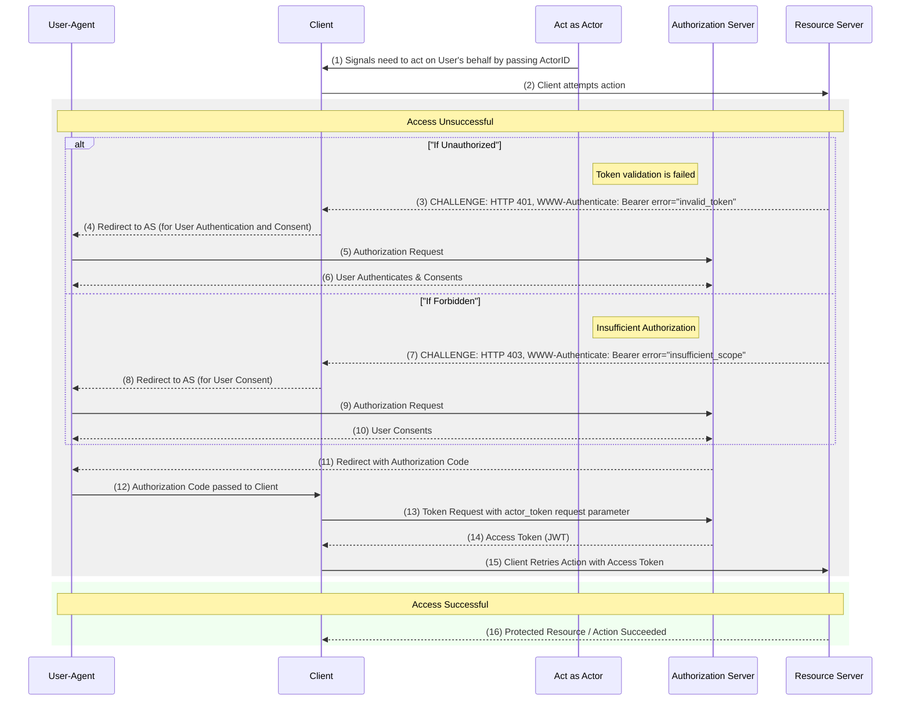

# OAuth 2.0 Extension: On-Behalf-Of User Authorization for AI Agents

原文链接: https://www.ietf.org/id/draft-oauth-ai-agents-on-behalf-of-user-01.html


| Internet-Draft | OAuth 2.0 Extension: On-Behalf-Of User A | May 2025 |
| --- | --- | --- |
| Senarath & Dissanayaka | Expires 9 November 2025 | [Page] |
| --- | --- | --- |


Workgroup:
Network Working Group
Internet-Draft:
draft-oauth-ai-agents-on-behalf-of-user-01
Published:
8 May 2025

Intended Status:
Informational
Expires:
9 November 2025
Authors:
T. S. Senarath
WSO2

A. Dissanayaka
WSO2


# OAuth 2.0 Extension: On-Behalf-Of User Authorization for AI Agents

## [Abstract](#abstract)

This specification extends the OAuth 2.0 Authorization Framework [[RFC6749](#RFC6749)] to enable AI agents to securely obtain access tokens for acting on behalf of users. It introduces the **requested\_actor** parameter in authorization requests to identify the specific agent requiring delegation and the **actor\_token** parameter in token requests to authenticate the agent during the exchange of an authorization code for an access token. The flow can be initiated by a resource server challenge, ensuring that user consent is obtained dynamically when access is attempted. This extension ensures secure delegation with explicit user consent, streamlines the authorization flow, and enhances auditability through access token claims that document the delegation chain from the user to the agent via a client application.[¶](#section-abstract-1)


## [Status of This Memo](#name-status-of-this-memo)

This Internet-Draft is submitted in full conformance with the
provisions of BCP 78 and BCP 79.[¶](#section-boilerplate.1-1)

Internet-Drafts are working documents of the Internet Engineering Task
Force (IETF). Note that other groups may also distribute working
documents as Internet-Drafts. The list of current Internet-Drafts is
at <https://datatracker.ietf.org/drafts/current/>.[¶](#section-boilerplate.1-2)

Internet-Drafts are draft documents valid for a maximum of six months
and may be updated, replaced, or obsoleted by other documents at any
time. It is inappropriate to use Internet-Drafts as reference
material or to cite them other than as "work in progress."[¶](#section-boilerplate.1-3)

This Internet-Draft will expire on 9 November 2025.[¶](#section-boilerplate.1-4)


## [Copyright Notice](#name-copyright-notice)

Copyright (c) 2025 IETF Trust and the persons identified as the
document authors. All rights reserved.[¶](#section-boilerplate.2-1)

This document is subject to BCP 78 and the IETF Trust's Legal
Provisions Relating to IETF Documents
(<https://trustee.ietf.org/license-info>) in effect on the date of
publication of this document. Please review these documents
carefully, as they describe your rights and restrictions with
respect to this document. Code Components extracted from this
document must include Revised BSD License text as described in
Section 4.e of the Trust Legal Provisions and are provided without
warranty as described in the Revised BSD License.[¶](#section-boilerplate.2-2)


[▲](#)
## [Table of Contents](#name-table-of-contents)


## [1.](#section-1) [Introduction](#name-introduction)

AI agents are increasingly common in systems, performing tasks on behalf of users. These agents often need access to protected resources, requiring a secure and robust authorization mechanism that clearly reflects the user's intent and the agent's role in the access request.[¶](#section-1-1)

Standard OAuth 2.0 flows, such as the Authorization Code Grant and the Client Credentials Grant [[RFC6749](#RFC6749)], do not fully address the complexities of agent delegation. They lack specific mechanisms to obtain explicit user consent for an agent's actions or to treat the agent as a distinct identity during the token exchange process.[¶](#section-1-2)

The OAuth 2.0 Token Exchange specification [[RFC8693](#RFC8693)] provides a framework for token exchange, but it is primarily designed for server-side communication or impersonation scenarios. It does not natively support obtaining explicit user consent for an agent via the front channel from the authorization endpoint. Furthermore, [[RFC8693](#RFC8693)] does not specify how to acquire the subject token, adding complexity to the delegation process.[¶](#section-1-3)

To overcome these limitations, this specification extends the OAuth 2.0 Authorization Code Grant flow to enable user-delegated authorization for AI agents. It introduces the following enhancements:[¶](#section-1-4)

1. The **requested\_actor** parameter at the authorization endpoint, allowing the client to specify the agent for which delegation is requested.[¶](#section-1-5.1.1)
2. The **actor\_token** parameter at the token endpoint, enabling the agent to authenticate itself when exchanging a user-approved authorization code for an access token.[¶](#section-1-5.2.1)
3. Detailed claims in the resulting access token, capturing the identities of the user, agent, and client application for transparency and auditability.[¶](#section-1-5.3.1)

This approach builds on existing OAuth 2.0 infrastructure to deliver a secure, simplified, and user-centric delegation process tailored for AI agents.[¶](#section-1-6)

The key words "MUST", "MUST NOT", "REQUIRED", "SHALL", "SHALL NOT", "SHOULD", "SHOULD NOT", "RECOMMENDED", "NOT RECOMMENDED", "MAY", and "OPTIONAL" in this document are to be interpreted as described in BCP 14 [[RFC2119](#RFC2119)] [[RFC8174](#RFC8174)] when, and only when, they appear in all capitals, as shown here.[¶](#section-1-7)


## [2.](#section-2) [Terminology](#name-terminology)

This specification uses the following terms:[¶](#section-2-1)

Actor:

An entity that acts on behalf of a user. In context of AI applications, the actor is the agent that performs actions on behalf of the user.[¶](#section-2-2.2.1)


Client:

An application that initiates the authorization flow and facilitates the interaction between the user, actor, and authorization server. This is the "client" as defined in OAuth 2.0 [[RFC6749](#RFC6749)].[¶](#section-2-2.4.1)


User:

The resource owner who grants consent for an actor to access their protected resources.[¶](#section-2-2.6.1)


Authorization Server:

The server that issues access tokens to the client and actor after successfully authenticating a resource owner and obtaining authorization.[¶](#section-2-2.8.1)


Resource Server:

The server hosting the protected resources, capable of accepting and validating access tokens. In context of AI applications, resource server can be a model context protocol (MCP) server, another agent or genaric protected resource.[¶](#section-2-2.10.1)


Authorization Code:

A temporary, single-use code issued by the authorization server to the client's redirect URI after the user has authenticated and granted consent for a specific actor to act on their behalf.[¶](#section-2-2.12.1)


Actor Token:

A security token (e.g., a JWT [[RFC7519](#RFC7519)]) used by an actor to authenticate itself to the authorization server or resource servers. The `sub` claim of an Actor Token identifies the actor. An actor can obtain an Actor Token by authenticating itself to the authorization server using a different grant, which is not included in the scope of this specification.[¶](#section-2-2.14.1)


Access Token:

An access token issued by the authorization server to an actor, permitting it to access protected resources on behalf of a specific user. This token explicitly documents the delegation path.[¶](#section-2-2.16.1)


## [3.](#section-3) [Protocol Overview](#name-protocol-overview)

This extension defines a flow where a client application facilitates user consent for an actor, and the actor then uses this consent along with its own authentication to obtain an access token.[¶](#section-3-1)

### [3.1.](#section-3.1) [High-Level Overview](#name-high-level-overview)

1. The Actor signals to the Client that it needs to perform an action on the User's behalf, providing its identifier (ActorID)[¶](#section-3.1-1.1.1)
2. The Client attempts the action by making a request to the Resource Server[¶](#section-3.1-1.2.1)
3. If access is unsuccessful (e.g., HTTP 401 Unauthorized due to an invalid/missing token, or HTTP 403 Forbidden due to insufficient scope), Resource Server challenges the Client.[¶](#section-3.1-1.3.1)

4.The Client initiates the authorization flow by redirecting the User's User-Agent to the Authorization Server's authorization endpoint. This request includes a requested\_actor parameter (matching the ActorID).[¶](#section-3.1-2)

1. The Authorization Server authenticates the User (if not already authenticated) and presents a consent screen detailing the Client, the requested\_actor, and the requested scopes.[¶](#section-3.1-3.1.1)
2. Upon User consent, the Authorization Server issues a short-lived Authorization Code (tied to the User, Client, and consented Actor) and redirects the User-Agent back to the Client's redirect\_uri.[¶](#section-3.1-3.2.1)
3. The Client receives the Authorization Code via the User-Agent redirect.[¶](#section-3.1-3.3.1)
4. The Client requests an Access Token from the Authorization Server's token endpoint. This request uses the standard authorization\_code grant type. The request includes the Authorization Code, the PKCE code\_verifier, and the actor\_token (the authentication token of the Actor).[¶](#section-3.1-3.4.1)
5. The Authorization Server validates the entire request: Authorization Code, PKCE code\_verifier, and the actor\_token. It ensures the actor\_token corresponds to the requested\_actor for whom the User granted consent (which is linked to the Authorization Code).[¶](#section-3.1-3.5.1)
6. Upon successful validation, the Authorization Server issues an Access Token to the Client. This token is a JWT containing claims identifying the User (e.g., sub), the Client (e.g., azp or client\_id), and the Actor (e.g., act claim).[¶](#section-3.1-3.6.1)
7. The Client retries the action or performs a new action on the Resource Server using this newly obtained Access Token.[¶](#section-3.1-3.7.1)
8. If access is successful (either initially or on retry): The Resource Server validates the Access Token (including the delegation claims like act) and processes the request, returning the resource or confirming the action.[¶](#section-3.1-3.8.1)

The Client may then pass the result to the Actor.
## Sequence Diagram[¶](#section-3.1-4)


[¶](#section-3.1-5)

The steps in the sequence diagram are as follows:[¶](#section-3.1-6)

1. Actor signals its intent to the Client, providing its identifier (ActorID).[¶](#section-3.1-7.1.1)
2. Client attempts to access protected resources on the Resource Server.[¶](#section-3.1-7.2.1)
3. If access is unsuccessful with token validation, the Resource Server challenges the Client with a WWW-Authenticate header indicating the invalid token error.[¶](#section-3.1-7.3.1)
4. Client redirects the User-Agent to the Authorization Server's authorization endpoint, including requested\_actor and PKCE challenge.[¶](#section-3.1-7.4.1)
5. User-Agent makes the Authorization Request to the Authorization Server.[¶](#section-3.1-7.5.1)
6. User authenticates and grants consent.[¶](#section-3.1-7.6.1)
7. If access is unsuccessful with insufficient scopes, the Resource Server challenges the Client with a WWW-Authenticate header indicating the insufficient scope error.[¶](#section-3.1-7.7.1)
8. Client redirects the User-Agent to the Authorization Server's authorization endpoint, including requested\_actor and PKCE challenge.[¶](#section-3.1-7.8.1)
9. User-Agent makes the Authorization Request to the Authorization Server.[¶](#section-3.1-7.9.1)
10. User grants consent.[¶](#section-3.1-7.10.1)
11. Authorization Server redirects the User-Agent back to the Client's redirect\_uri with an Authorization Code.[¶](#section-3.1-7.11.1)
12. Client receives the Authorization Code via the User-Agent redirect.[¶](#section-3.1-7.12.1)
13. Client requests an Access Token from the Authorization Server's token endpoint, including the Authorization Code, PKCE code\_verifier, and actor\_token.[¶](#section-3.1-7.13.1)
14. Authorization Server validates the request and issues an Access Token (JWT) to the Client.[¶](#section-3.1-7.14.1)
15. Client retries the action on the Resource Server using the newly obtained Access Token.[¶](#section-3.1-7.15.1)
16. Resource Server validates the Access Token and processes the request, returning the protected resource or confirming the action.[¶](#section-3.1-7.16.1)


## [4.](#section-4) [Detailed Protocol Steps](#name-detailed-protocol-steps)

### [4.1.](#section-4.1) [User Authorization Request](#name-user-authorization-request)

The client initiates the flow by directing the user's user-agent to the authorization server's authorization endpoint. This request is the standard Authorization Code Grant request (Section 4.1.1 of [[RFC6749](#RFC6749)]) and MUST include the `requested_actor` request parameter.[¶](#section-4.1-1)

```

GET /authorize?response_type=code&
client_id=<client_id>&
redirect_uri=<redirect_uri>&
scope=<scope>&
state=<state>&
code_challenge=<code_challenge>&
code_challenge_method=S256&
requested_actor=<actor_id> HTTP/1.1

```
[¶](#section-4.1-2)

#### [4.1.1.](#section-4.1.1) [Parameters](#name-parameters)

requested\_actor:

REQUIRED. The unique identifier of the actor for which the client is requesting delegated access on behalf of the user. This identifier MUST uniquely identify the actor within the system and MUST be understood by the Authorization Server.[¶](#section-4.1.1-1.2.1)


other parameters:

The request MUST also include the standard OAuth 2.0 parameters such as `response_type`, `client_id`, `redirect_uri`, `scope`, `state`, and PKCE parameters (`code_challenge` and `code_challenge_method`).[¶](#section-4.1.1-1.4.1)


#### [4.1.2.](#section-4.1.2) [Authorization Server Processing](#name-authorization-server-proces)

Upon receiving the authorization request, the Authorization Server MUST perform the following steps:[¶](#section-4.1.2-1)

1. Validate the request parameters according to the OAuth 2.0 Authorization Code Grant (Section 4.1.1 of [[RFC6749](#RFC6749)]).[¶](#section-4.1.2-2.1.1)
2. Validate the `requested_actor`. The Authorization Server MUST verify that the provided requested\_actor corresponds to a recognized actor identity.[¶](#section-4.1.2-2.2.1)
3. Authorization server MAY display a consent screen to the User. This screen SHOULD clearly indicate:[¶](#section-4.1.2-2.3.1)
   
   * The name or identity of the client application initiating the request.[¶](#section-4.1.2-2.3.2.1.1)
   * The identity of the actor (requested\_actor) for which delegation is being requested.[¶](#section-4.1.2-2.3.2.2.1)
   * The specific scopes of access being requested.[¶](#section-4.1.2-2.3.2.3.1)

If the request is valid and the user grants consent, the Authorization Server proceeds to issue an Authorization Code. If the request is invalid, the Authorization Server returns an Error Response.[¶](#section-4.1.2-3)


#### [4.1.3.](#section-4.1.3) [Authorization Code Response](#name-authorization-code-response)

If the user grants consent, the Authorization Server issues an Authorization Code and redirects the user-agent back to the client's redirect\_uri (if provided in the request) or a pre-registered redirect URI.[¶](#section-4.1.3-1)

```

HTTP/1.1 302 Found
Location: <redirect_uri>?code=<authorization_code>&state=<state>

```
[¶](#section-4.1.3-2)

##### [4.1.3.1.](#section-4.1.3.1) [Parameters](#name-parameters-2)

Similar to the standard Authorization Code Grant (Section 4.1.2 of [[RFC6749](#RFC6749)]), the response includes:[¶](#section-4.1.3.1-1)

code:

REQUIRED. The Authorization Code is issued by the Authorization Server.[¶](#section-4.1.3.1-2.2.1)


state:

OPTIONAL. The state parameter passed in the initial request, if present. This value MUST be included in the redirect URI to maintain state between the request and callback.[¶](#section-4.1.3.1-2.4.1)


#### [4.1.4.](#section-4.1.4) [Error Response](#name-error-response)

If the request fails, the Authorization Server redirects the user-agent back to the client's redirect\_uri with error parameters.[¶](#section-4.1.4-1)

```

HTTP/1.1 302 Found
Location: <redirect_uri>?error=<error_code>&state=<state>

```
[¶](#section-4.1.4-2)


### [4.2.](#section-4.2) [Access Token Request](#name-access-token-request)

Upon receiving the Authorization Code, the client then requests an Access Token from the Authorization Server's token endpoint using the authorization\_code grant type with the actor\_token request parameter.[¶](#section-4.2-1)

```

POST /token HTTP/1.1
Host: authorization-server.com
Content-Type: application/x-www-form-urlencoded

grant_type=authorization_code&
client_id=<client_id>&
code=<authorization_code>&
code_verifier=<code_verifier>&
redirect_uri=<redirect_uri>&
actor_token=<actor_token>

```
[¶](#section-4.2-2)

#### [4.2.1.](#section-4.2.1) [Parameters](#name-parameters-3)

actor\_token:

REQUIRED. The actor token is used to authenticate the actor. This token MUST be a valid token issued to the actor and MUST include the `sub` claim identifying the actor.[¶](#section-4.2.1-1.2.1)


other parameters:

The request MUST also include the standard OAuth 2.0 parameters such as `client_id`, `code`, `code_verifier`, and `redirect_uri`.[¶](#section-4.2.1-1.4.1)


#### [4.2.2.](#section-4.2.2) [Authorization Server Processing](#name-authorization-server-process)

Upon receiving the token request, the Authorization Server MUST perform the following steps:[¶](#section-4.2.2-1)

1. Validate the request parameters according to the OAuth 2.0 Token Endpoint (Section 4.1.3 of [[RFC6749](#RFC6749)]).[¶](#section-4.2.2-2.1.1)
2. The Authorization Server MUST verify that the actor token is valid, not expired.[¶](#section-4.2.2-2.2.1)
3. Verify that the authenticated actor identity (obtained from the Actor Token's sub claim) matches the requested\_actor value that the user consented to during the initial Authorization Request and which is associated with the code.[¶](#section-4.2.2-2.3.1)

If all validations pass, the Authorization Server issues an Access Token. If any validation fails, the Authorization Server returns an Error Response.[¶](#section-4.2.2-3)


#### [4.2.3.](#section-4.2.3) [Access Token Response](#name-access-token-response)

If the Token Request is valid, the Authorization Server issues an Access Token to the actor. This token SHOULD be a JSON Web Token (JWT) [[RFC7519](#RFC7519)] to include claims that document the delegation.[¶](#section-4.2.3-1)

```

HTTP/1.1 200 OK
Content-Type: application/json;charset=UTF-8
Cache-Control: no-store
Pragma: no-cache

{
  "access_token": "<delegated_access_token>",
  "token_type": "Bearer",
  "expires_in": 3600,
  "scope": "<granted_scope>"
}

```
[¶](#section-4.2.3-2)

##### [4.2.3.1.](#section-4.2.3.1) [Parameters](#name-parameters-4)

Similar to the standard Authorization Code Grant (Section 4.1.4 of [[RFC6749](#RFC6749)])[¶](#section-4.2.3.1-1)


#### [4.2.4.](#section-4.2.4) [Error Response](#name-error-response-2)

If the request is invalid, the Authorization Server returns an error response with an HTTP 400 (Bad Request) status code.[¶](#section-4.2.4-1)

```

HTTP/1.1 400 Bad Request
Content-Type: application/json;charset=UTF-8
Cache-Control: no-store
Pragma: no-cache

{
  "error": "invalid_grant"
}

```
[¶](#section-4.2.4-2)


### [4.3.](#section-4.3) [Access Token Structure and Claims](#name-access-token-structure-and-)

The Access Token SHOULD be a JWT Profile for OAuth 2.0 Access Tokens [[RFC9068](#RFC9068)]. It SHOULD carry claims that explicitly document the delegation chain.[¶](#section-4.3-1)

In addition to standard JWT claims (e.g., iss, aud, exp, iat, jti), an Access Token issued via this flow MUST contain the following claims:[¶](#section-4.3-2)

act:

REQUIRED. Actor - represents the party acting on behalf of the subject (Section 4.1 of [[RFC8693](#RFC8693)]). In an Access Token issued via this flow, this claim MUST contain a JSON object with at least the following member:
\* sub: REQUIRED. The unique identifier of the actor that is acting on behalf of the user.
\* Additional members MAY be included in the act claim.[¶](#section-4.3-3.2.1)


Example Decoded JWT Payload:[¶](#section-4.3-4)

```

{
  "iss": "https://authorization-server.com/oauth2/token",
  "aud": "resource_server",
  "sub": "user-456",
  "azp": "s6BhdRkqt3",
  "scope": "read:email write:calendar",
  "exp": 1746009896,
  "iat": 1746006296,
  "jti": "unique-token-id",
  "act": {
    "sub": "actor-finance-v1"
  },
  "aut": "APPLICATION_USER"
}

```
[¶](#section-4.3-5)

Resource Servers consuming this token can inspect the `sub` claim to identify the user and the act.sub claim to identify the specific actor that is performing the action. This provides a clear and auditable delegation path.[¶](#section-4.3-6)


### [4.4.](#section-4.4) [Resource Server Challenge](#name-resource-server-challenge)

The authorization flow is often triggered by a resource server challenge, such as an HTTP 401 (Unauthorized) or 403 (Forbidden) response, indicating a missing, invalid, or insufficient access token. This prompts the client to initiate the authorization process to obtain user consent and a valid token.[¶](#section-4.4-1)

When the client, prompted by an actor or speculatively, requests a protected resource, it includes an access token in the Authorization header if available. If the token is invalid or lacks required scopes or delegation claims, the resource server returns a challenge with a WWW-Authenticate header (e.g., error="invalid\_token" or error="insufficient\_scope"). The client then redirects the user's user-agent to the authorization server's authorization endpoint to obtain an authorization code.[¶](#section-4.4-2)

```

GET /some/protected/resource HTTP/1.1
Host: resource-server.com
Authorization: Bearer <existing_access_token_if_any>

```
[¶](#section-4.4-3)

#### [4.4.1.](#section-4.4.1) [Resource Server Processing](#name-resource-server-processing)

Upon receiving the request, the Resource Server MUST validate the Access Token (if provided). This validation includes:[¶](#section-4.4.1-1)

1. Ensuring the token is present if required.[¶](#section-4.4.1-2.1.1)
2. Verifying the token's signature, issuer, and audience.[¶](#section-4.4.1-2.2.1)
3. Checking if the token is expired or revoked.[¶](#section-4.4.1-2.3.1)
4. Confirming the token contains the necessary scopes for the requested action.[¶](#section-4.4.1-2.4.1)
5. If the resource requires action on behalf of a specific Actor, verifying the token contains the appropriate delegation claims (e.g., an act claim) for that Actor.[¶](#section-4.4.1-2.5.1)

If the Access Token is missing, invalid, or insufficient for the requested action, the Resource Server MUST return an error response, typically an HTTP 400 (Bad Request), HTTP 401 (Unauthorized) or HTTP 403 (Forbidden), including a WWW-Authenticate header.[¶](#section-4.4.1-3)


#### [4.4.2.](#section-4.4.2) [The WWW-Authenticate Response Header Field](#name-the-www-authenticate-respon)

The Resource Server MUST include a WWW-Authenticate header field in the response to indicate the reason for the challenge. This header field MUST include the error code and other relevant information.[¶](#section-4.4.2-1)

Example:[¶](#section-4.4.2-2)

```

HTTP/1.1 403 Forbidden
WWW-Authenticate: Bearer error="insufficient_scope", error_description="The access token does not have the required scope(s)", required_scope="scope1 scope2"
Content-Type: application/json;charset=UTF-8

{
  "error": "insufficient_scope",
  "error_description": "The access token does not have the required scope(s)",
  "required_scope": "scope1 scope2"
}

```
[¶](#section-4.4.2-3)


## [5.](#section-5) [Security Considerations](#name-security-considerations)

Actor Authentication:

The security of this flow relies heavily on the Authorization Server's ability to securely authenticate the actor during the Token Request using the Actor Token. The method by which actors obtain and secure their Actor Tokens is critical and outside the scope of this specification, but MUST be implemented securely.[¶](#section-5-1.2.1)


Proof Key for Code Exchange (PKCE):

PKCE [[RFC7636](#RFC7636)] is REQUIRED to prevent authorization code interception attacks, especially relevant if the client (and thus the actor receiving the code) is a public client or runs in an environment where the redirect URI cannot be strictly protected.[¶](#section-5-1.4.1)


Single-Use and Short-Lived Authorization Codes:

Authorization Codes MUST be single-use and have a short expiration time to minimize the window for compromise.[¶](#section-5-1.6.1)


Binding Code to Actor and Client:

The Authorization Server MUST bind the Authorization Code to the specific user, client (client\_id), and requested actor (requested\_actor) during issuance and verify this binding during the Token Request.[¶](#section-5-1.8.1)


Clear User Consent:

The consent screen presented to the user SHOULD clearly identify the actor and the requested scopes to ensure the user understands exactly what authority they are delegating and to whom.[¶](#section-5-1.10.1)


Auditability:

The claims in the Access Token (sub, act) provide essential information for auditing actions performed using the token, clearly showing who (user) authorized the action, which application (client) facilitated it, and which entity (actor) performed it.[¶](#section-5-1.12.1)


## [6.](#section-6) [Normative References](#name-normative-references)

[RFC2119]
Bradner, S., "Key words for use in RFCs to Indicate Requirement Levels", BCP 14, RFC 2119, DOI 10.17487/RFC2119, March 1997, <<https://www.rfc-editor.org/rfc/rfc2119>>. 

[RFC6749]
Hardt, D., Ed., "The OAuth 2.0 Authorization Framework", RFC 6749, DOI 10.17487/RFC6749, October 2012, <<https://www.rfc-editor.org/rfc/rfc6749>>. 

[RFC7519]
Jones, M., Bradley, J., and N. Sakimura, "JSON Web Token (JWT)", RFC 7519, DOI 10.17487/RFC7519, May 2015, <<https://www.rfc-editor.org/rfc/rfc7519>>. 

[RFC7636]
Sakimura, N., Ed., Bradley, J., and N. Agarwal, "Proof Key for Code Exchange by OAuth Public Clients", RFC 7636, DOI 10.17487/RFC7636, September 2015, <<https://www.rfc-editor.org/rfc/rfc7636>>. 

[RFC8174]
Leiba, B., "Ambiguity of Uppercase vs Lowercase in RFC 2119 Key Words", BCP 14, RFC 8174, DOI 10.17487/RFC8174, May 2017, <<https://www.rfc-editor.org/rfc/rfc8174>>. 

[RFC8693]
Jones, M., Nadalin, A., Campbell, B., Ed., Bradley, J., and C. Mortimore, "OAuth 2.0 Token Exchange", RFC 8693, DOI 10.17487/RFC8693, January 2020, <<https://www.rfc-editor.org/rfc/rfc8693>>. 

[RFC9068]
Bertocci, V., "JSON Web Token (JWT) Profile for OAuth 2.0 Access Tokens", RFC 9068, DOI 10.17487/RFC9068, October 2021, <<https://www.rfc-editor.org/rfc/rfc9068>>. 


## [Authors' Addresses](#name-authors-addresses)

Thilina Shashimal Senarath
WSO2
Email:
[thilinasenarath97@gmail.com](mailto:thilinasenarath97@gmail.com)


Ayesha Dissanayaka
WSO2
Email:
[ayshsandu@gmail.com](mailto:ayshsandu@gmail.com)


