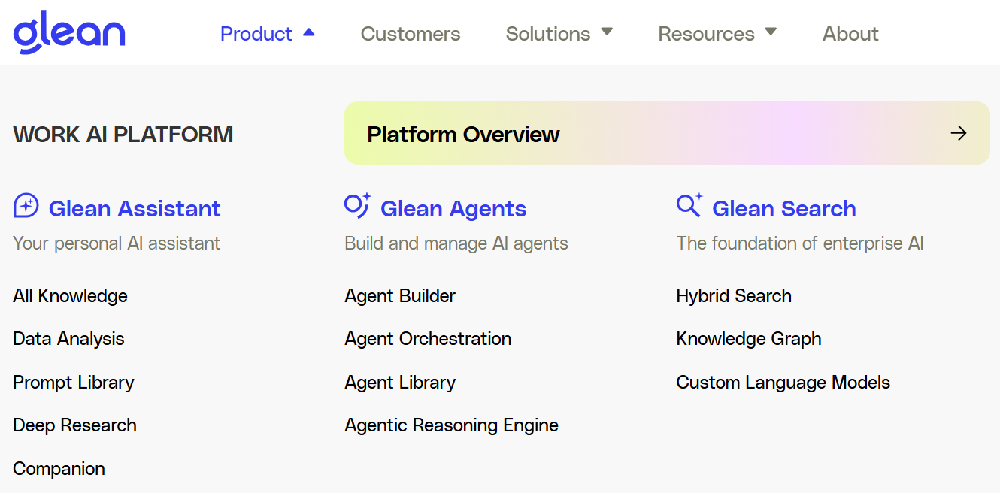
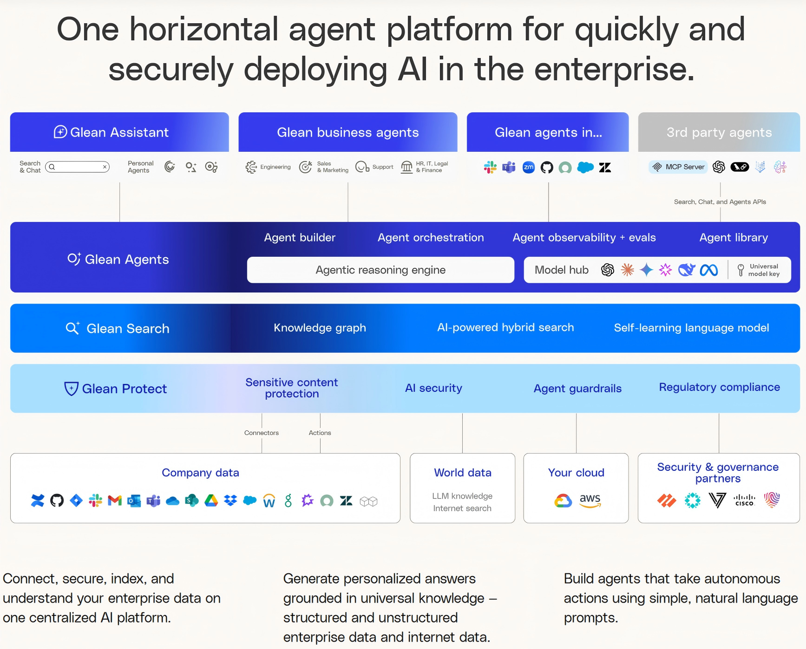
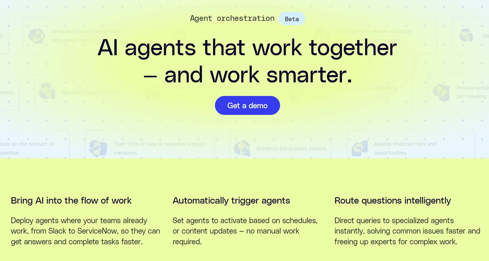
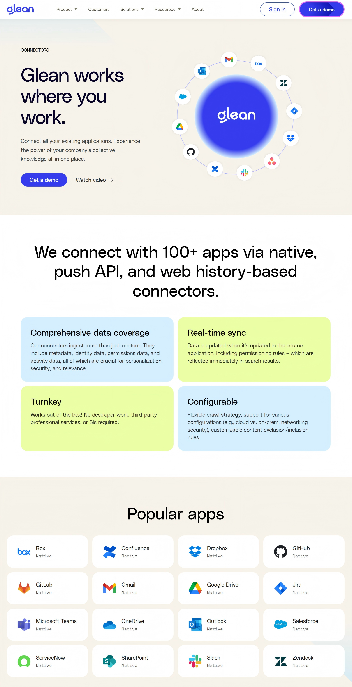
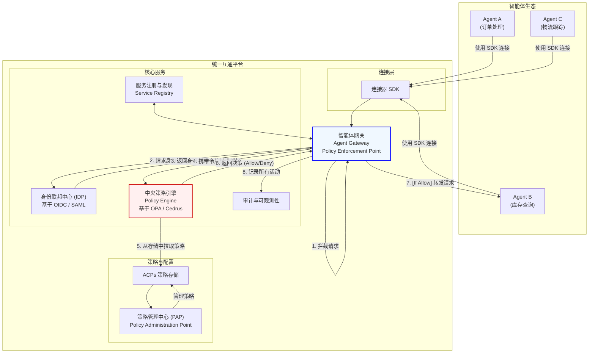
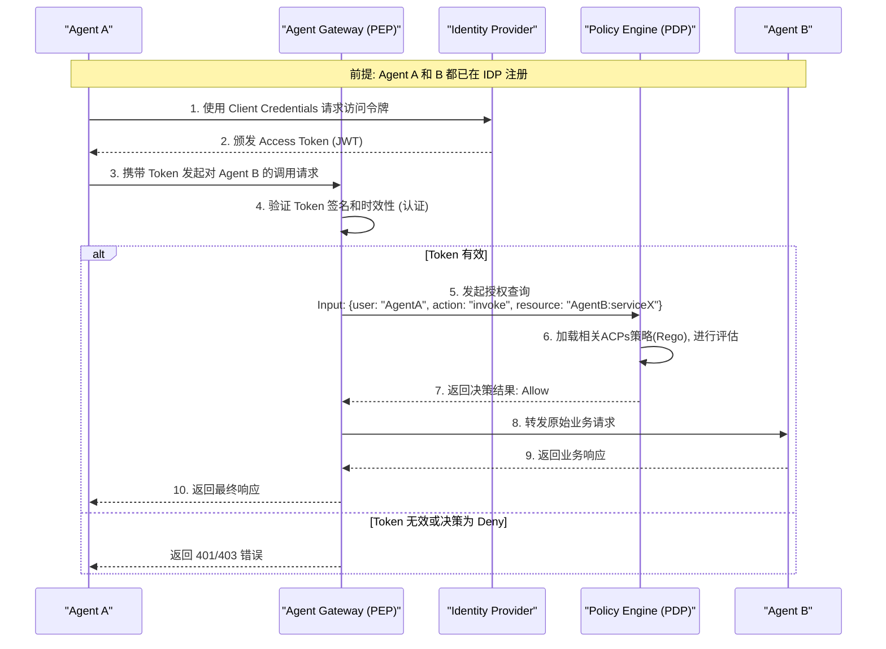

# 深度调研报告：从 Glean 到统一认证 AI 平台蓝图

## 第一部分：Glean 模式深度剖析与战略洞察

### 1. 核心价值再审视：不止于搜索

Glean 的成功并非仅仅是打造了一个"更好用的企业搜索框"。它的真正价值在于，通过 AI 技术，重塑了企业内部"人"与"信息"的连接关系。它解决了数字原生企业最头痛的两个问题：

- **知识熵增**：信息散落在上百个 SaaS 应用中，形成无数个"数据孤岛"，查找、关联、利用信息的成本呈指数级增长。
- **权限黑盒**：传统的知识共享要么过于开放导致安全风险，要么过于保守导致协作效率低下。权限管理复杂且不透明。

Glean 的解决方案本质上是一个 "以人为中心的知识与权限双引擎平台"。

### 2. 产品架构与技术体系

#### 2.1 三大产品线布局

Glean 目前形成了三条清晰的产品线，共同构成了其企业 AI 平台战略：

1. **Glean Assistant**：个人 AI 助手
   - 全知识库访问能力
   - 数据分析功能
   - 提示词库
   - 深度研究能力
   - AI 伴侣功能

2. **Glean Agents**：构建和管理 AI 智能体
   - Agent Builder：智能体构建工具
   - Agent Orchestration：智能体编排系统
   - Agent Library：智能体库
   - Agentic Reasoning Engine：智能体推理引擎

3. **Glean Search**：企业 AI 的基础设施
   - Hybrid Search：混合搜索技术
   - Knowledge Graph：知识图谱
   - Custom Language Models：自定义语言模型

#### 2.2 整体平台架构

Glean 的平台架构可以概括为"一个水平 Agent 平台，用于在企业中快速安全地部署 AI"。整体架构分为以下几个关键层次：

1. **用户交互层**
   - Glean Assistant：搜索、聊天和个人智能体
   - Glean Business Agents：工程、销售、营销、支持等业务部门的专属智能体
   - Glean Agents：多种部署场景下的智能体
   - 第三方智能体：支持 MCP Server 等协议的外部智能体接入

2. **智能体功能层**
   - Agent Builder：智能体构建工具
   - Agent Orchestration：智能体编排系统
   - Agent Observability：智能体监控与评估
   - Agent Library：智能体库
   - Agentic Reasoning Engine：智能体推理引擎
   - Model Hub：模型中心

3. **搜索与知识层**
   - Knowledge Graph：知识图谱
   - AI-Powered Hybrid Search：AI 驱动的混合搜索
   - Self-Learning Language Model：自学习语言模型

4. **安全与治理层**
   - Glean Protect：安全保护体系
   - Sensitive Content Protection：敏感内容保护
   - AI Security：AI 安全
   - Agent Guardrails：智能体护栏
   - Regulatory Compliance：监管合规

5. **数据连接层**
   - Company Data：连接企业内部数据源（Jira、GitHub、Google Drive、Microsoft 365 等）
   - World Data：连接世界知识（LLM 知识、互联网搜索）
   - Cloud Integration：云平台集成
   - Security & Governance Partners：安全与治理合作伙伴

这种架构设计使 Glean 能够：

1. "连接、保护、索引和理解企业数据，集中在一个 AI 平台上"
2. "生成基于通用知识的个性化答案 - 结构化和非结构化的企业数据与互联网数据"
3. "使用简单、自然的语言提示构建能够采取自主行动的智能体"

#### 2.3 核心技术组件详解

##### 2.3.1 核心架构组件

基于 Glean 的整体架构，平台包含以下核心组件：

- **Knowledge Graph（知识图谱）**：构建企业内部的知识图谱
- **AI-Powered Hybrid Search（AI 驱动的混合搜索）**：结合传统搜索和语义搜索
- **Self-Learning Language Model（自学习语言模型）**：自适应的语言模型

##### 2.3.2 Agent 编排机制

Glean 的 Agent Orchestration 是其平台的核心创新之一，实现了"AI agents that work together - and work smarter"的愿景。这里的编排对象确实是多个独立的 Agent 之间的协作，而非单个 Agent 内部的工作流编排。

**核心编排能力包括：**

1. **Trigger（触发）**
   - 基于计划、业务事件或特定条件主动激活智能体
   - 支持事件驱动的自动化，如"当新的 Salesforce 账户创建时"自动触发相关智能体
   - 无需手动干预，实现真正的智能自动化

2. **Route（路由）**
   - 智能将用户请求路由到最适合的专业智能体
   - 支持多种专业智能体类型：
     - Lead evaluation（潜在客户评估）
     - Customer insights（客户洞察）
     - Compliance risk assessment（合规风险评估）
   - 加快问题解决速度，释放专家处理复杂工作

3. **Integrate（集成）**
   - 在现有工作流程中无缝集成 Glean 智能体
   - 支持主流协作平台：Slack、Teams、ServiceNow 等
   - 提供细粒度权限控制：通过 Slack、API 或嵌入方式访问智能体都受到权限限制
   - 用户无需切换上下文即可获得 AI 助手支持

4. **Coordinate（协调）**
   - 让专业智能体跨平台协同工作完成复杂工作流程
   - 实现智能体间的自动交接和协作
   - 支持复杂业务场景的端到端自动化处理

5. **Refine（优化）**
   - 支持运行时动态调整触发器、路由逻辑或智能体流程
   - 工作流程可随时间不断改进和优化
   - 无需重新构建即可实现流程迭代

**编排架构特点：**
- **水平编排**：在同等层级的多个 Agent 之间进行协调
- **事件驱动**：基于业务事件和条件自动触发流程
- **智能路由**：根据请求内容和上下文智能选择最佳处理智能体
- **无缝集成**：嵌入现有工作流程，减少用户学习成本

##### 2.3.3 连接器生态系统

Glean 构建了强大的连接器生态系统，实现了"连接所有现有应用，在一个地方体验公司集体知识的力量"。

**连接规模与覆盖：**
- 支持 100+ 企业应用的原生连接
- 通过三种连接方式：Native、Push API、Web History-based
- 涵盖主流企业应用：Box、Zendesk、Gmail、Outlook、Dropbox、GitHub、Google Drive、Salesforce 等

**连接器核心特性：**

1. **Comprehensive Data Coverage（全面数据覆盖）**
   - 不仅获取内容本身，更重要的是获取元数据
   - 包括身份数据、权限数据和活动数据
   - 这些数据对个性化、安全性和相关性至关重要

2. **Real-time Sync（实时同步）**
   - 源应用中的数据更新会立即反映到 Glean 中
   - 权限规则的变更也会实时同步
   - 确保搜索结果始终基于最新的权限状态

3. **Turnkey（开箱即用）**
   - 无需开发工作、第三方专业服务或 SLA 要求
   - 即插即用的连接体验
   - 大幅降低企业接入成本

4. **Configurable（高度可配置）**
   - 灵活的抓取策略配置
   - 支持多种部署模式（云端 vs 本地、网络安全等）
   - 可定制内容排除/包含规则
   - 适应不同企业的特定需求

这种连接器架构体现了 Glean "连接创造价值"的核心理念，为智能体编排提供了跨系统协作的基础能力。

### 3. 战略洞察与启示

基于对 Glean 产品架构和技术体系的分析，我们可以得出以下战略洞察：

- **权限不是功能的补充，而是平台的核心**：对于 To B 业务，尤其是在多系统集成的场景下，一个无法 100% 复制和执行源系统权限的平台是毫无价值的。

- **"连接"创造价值**：平台的价值与其连接器的广度和深度成正比。一个强大的、易于扩展的连接器框架是生态的起点。

- **从"工具"到"大脑"**：Glean 不只是提供信息，它还通过知识图谱和 AI 提供"洞察"。我们的平台也应该思考，在解决了 Agent 互联互通后，能提供什么样的增值智能服务（如调用链分析、异常行为检测）。

- **平台化思维**：Glean 不是简单提供单个 AI 工具，而是构建了完整的平台生态，包括助手、智能体构建、基础设施等多个维度。

- **安全与合规的核心地位**：将安全保护、敏感内容管理、智能体护栏等功能作为架构的基础层，体现了"安全优先"的设计理念。

- **多层次智能体架构**：从个人助手到业务智能体到通用智能体平台，形成了完整的智能体生态体系。

## 第二部分：统一认证 AI 平台技术蓝图

借鉴 Glean 的成功模式，尤其是其对身份与权限的深刻理解，我们可以为"智能体间安全互联互通平台"设计一个清晰、可行的技术蓝图。

### 1. 核心原则：零信任架构 (Zero Trust Architecture)

我们的平台必须根植于"零信任"原则：从不信任，总是验证。网络位置不再代表信任，每一次 Agent 间的调用，都必须经过严格的身份认证和动态的权限授权。

### 2. 平台详细架构蓝图

### 3. 核心组件与技术选型

#### 智能体网关 (Agent Gateway)

- **角色**：平台唯一的流量入口，所有 Agent 间的通信都必须经过它。它是策略的 "执行点 (PEP)"。
- **技术选型**：可基于开源网关（如 Kong, Traefik, APISIX）进行二次开发，集成自定义的认证和授权逻辑。

#### 身份联邦中心 (IDP)

- **角色**：负责 Agent 的注册、身份颁发和认证。当 Agent 首次接入时，IDP 会为其颁发客户端凭证（Client ID/Secret）。在每次请求时，Agent 使用凭证向 IDP 换取有时效性的访问令牌（Access Token, 如 JWT）。
- **技术选型**：推荐使用遵循 OAuth 2.0 / OpenID Connect (OIDC) 标准的成熟身份认证服务器，如 Keycloak, Okta, 或自研。

#### 中央策略引擎 (Policy Engine)

- **角色**：平台的 "决策大脑 (PDP)"，对标 Glean 的权限图谱。它接收来自网关的授权请求（如："Agent A 是否能调用 Agent B 的 query_stock 方法？"），并基于存储的策略（ACPs）给出"允许"或"拒绝"的裁决。
- **技术选型**：强烈推荐使用 Open Policy Agent (OPA)。OPA 是一个通用的开源策略引擎，它使用一种名为 Rego 的声明性语言来编写策略，非常适合解耦策略逻辑和业务逻辑。ACPs 协议组可以被翻译成 Rego 策略，由 OPA 执行。

### 4. 核心流程：一次安全的 Agent 间调用

### 5. 实施路线图

#### 第一阶段 (MVP)
- 搭建核心框架：部署 OPA 和 Keycloak
- 开发 Agent Gateway 的基础版本，集成 OIDC 认证和 OPA 授权
- 提供第一版连接器 SDK，支持手动配置和注册 Agent
- 实现核心的调用流程

#### 第二阶段 (平台化)
- 开发策略管理中心 (PAP) 的 UI 界面，让管理员可以方便地管理 ACPs 策略
- 完善审计和日志平台
- 丰富连接器 SDK 的功能，支持更多协议和语言

#### 第三阶段 (智能化与生态)
- 基于审计日志，分析 Agent 调用行为，提供调用链可视化、异常检测等增值服务
- 建立开发者社区，鼓励第三方开发和贡献连接器

通过这套结合了 Glean 思想和零信任架构的蓝图，我们可以构建一个既安全合规又高效互通的智能体平台，为未来的 AI 应用生态打下坚实的基础。
