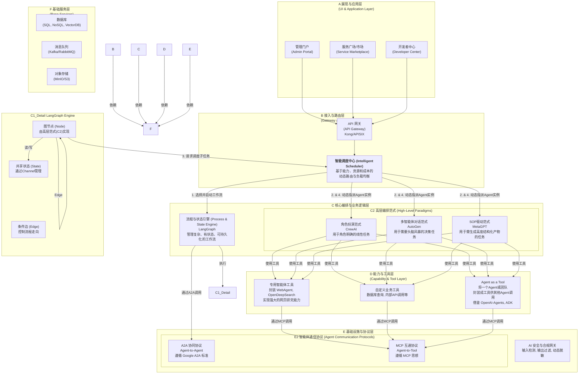

# 智能体互通平台技术方案 (V0.1.0)

## 1. 项目愿景与核心思想

### 1.1 项目背景与目标

（复用在"项目背景"和"建设目标"中的描述）

随着生成式AI技术的演进，多智能体系统（MAS）已成为企业智能化转型的关键。然而，不同厂商、平台、模型构建的智能体各自为政，导致信息孤岛、能力无法复用、安全与合规难以保障。

本项目旨在构建一个**统一、可信、安全、高效的智能体互通平台**，作为智能体应用的"操作系统"和"中枢神经"，实现智能体之间的互联互通、信任认证与协同可控，推动AI从"单体智能"迈向"协同智能"。

### 1.2 核心设计思想：分层解耦，博采众长

我们拒绝重复造轮子，也避免被单一框架锁定。正如您在技术版图报告中指出的，最佳方案是构建一个**分层解耦、各取所长**的融合架构。本方案将严格遵循此思想，以业界最优秀的开源项目作为我们不同层次的最佳实践，构建一个开放、灵活且强大的平台。

## 2. 总体技术架构

我们的架构是一个清晰的、自下而上构建的系统，确保每一层都高度内聚、职责单一。



## 3. 平台定位与用户视图

为确保平台建设的目标清晰，我们必须明确其服务对象和不同用户群体的核心需求。本平台定位为企业级（To-B）服务，旨在成为企业内部的智能中枢，因此需要为不同角色的用户提供差异化但互补的视图和工具。

### 3.1 平台定位：企业级 (B2B) 智能中枢

本平台并非面向个人消费者（To-C），而是服务于企业客户（To-B）。其核心价值是作为一套企业级的AI基础设施，解决企业内部因部门、供应商、技术栈不同而导致的AI能力分散、数据不通、重复建设等问题，帮助企业构建统一、可控、高效的智能体生态系统。

### 3.2 开发者视图：构建与集成 (SDK & API)

开发者是平台的"建设者"，他们负责创造和集成平台上的各种能力。我们为开发者提供：

*   **SDK (软件开发工具包)**: **这是赋能开发者的核心**。平台将提供功能强大的Python SDK，作为开发者的首选工具。
    *   **能力封装**: 通过简单的装饰器（如 `@mcp.tool`），开发者能快速将任意函数或业务逻辑封装成符合平台标准的、安全的工具微服务。
    *   **服务调用**: SDK 内置了与A2A网关、智能调度中心等核心服务交互的客户端，让开发者可以轻松地调用其他Agent或发起一个工作流，而无需关心底层通信细节。
    *   **目标**: 极大降低开发门槛，提升构建新Agent和新工具的效率。

*   **API (应用程序接口)**: **这是保障开放性和集成能力的基础**。对于无法使用SDK的异构系统（如Java、Go编写的遗留服务），或需要从外部BPM、OA系统触发平台内工作流的场景，平台必须暴露一套稳定、标准化的RESTful和gRPC API。SDK本身也是对这套API的友好封装。

*   **开发者中心 (Developer Center)**: 一个专为开发者设计的Web门户，提供一站式服务，包括：
    *   Agent和工具的注册与管理。
    *   获取和管理API密钥等认证凭据。
    *   交互式的API文档和测试工具 (Swagger/OpenAPI)。
    *   监控由其开发的服务状态、性能指标和调用日志。

### 3.3 业务用户视图：使用与编排 (GUI & 市场)

业务用户（如业务分析师、运营经理）是平台能力的"使用者"和"流程编排者"。他们不编写代码，追求开箱即用的解决方案。我们为业务用户提供：

*   **服务市场 (Service Marketplace)**: 一个可视化的企业内部"Agent商店"。业务用户可在此浏览、发现、了解所有已注册的Agent和工具的能力，清楚地知道平台能为他们解决什么问题。

*   **管理门户 (Admin Portal)**: 一个强大的图形化管理界面，其核心是提供**无代码/低代码的工作流编排能力**。
    *   **流程设计**: 业务用户可以通过简单的拖拽操作，将服务市场中的不同Agent（如"财报分析Agent"、"图表生成Agent"、"邮件发送Agent"）连接起来，像搭建乐高一样构建和发布一个自动化的业务流程。
    *   **监控与运维**: 监控由其编排的业务流程的执行状态，查看产出结果，并进行高阶的用户权限管理和数据看板分析。

*   **最终应用 (Final Applications)**: 多数业务用户最终将在他们熟悉的日常办公软件（如CRM、ERP、钉钉、企业微信）中，通过与这些系统集成的Agent，无感地享受到平台带来的效率提升。

## 4. 核心模块详细设计

### 4.1 基础设施与协议层 (Infrastructure & Protocol)

这是平台稳定运行的基石，我们采用业界标准协议来确保开放性和互操作性。

#### 4.1.1 MCP (Agent-to-Tool) 互通协议

-   **核心职责**: 定义一套标准，让平台上的任何 Agent 都能以统一、安全的方式发现和调用工具。

-   **实现机制**:
    1.  **工具即服务 (Tool as a Service)**: 借鉴 `Agent Zero` 和 `MCP-Server` 的思想，将具有潜在风险或需要独立环境的工具（如**文件读写**、**代码执行**、**Git操作**、**网页浏览**）封装成独立的、沙箱化的**微服务**。推荐使用 **Docker** 容器进行隔离。
    2.  **标准化描述 (OpenAPI v3)**: 每个工具服务必须提供一个符合 OpenAPI v3 规范的描述文件。

-   **API协议示例: `tool.json` (OpenAPI v3)**
    ```yaml
    openapi: 3.0.0
    info:
      title: 安全代码执行器 (Safe Code Executor)
      version: 1.0.0
      description: 在隔离的Docker沙箱中执行Python或Shell脚本。
    servers:
      - url: http://mcp-code-executor.service.cluster.local
    paths:
      /execute:
        post:
          summary: 执行一段代码
          operationId: executeCode
          requestBody:
            required: true
            content:
              application/json:
                schema:
                  $ref: '#/components/schemas/ExecuteRequest'
          responses:
            '200':
              description: 代码执行成功
              content:
                application/json:
                  schema:
                    $ref: '#/components/schemas/ExecuteResponse'
    components:
      schemas:
        ExecuteRequest:
          type: object
          properties:
            language:
              type: string
              enum: [python, shell]
            code:
              type: string
            timeout:
              type: integer
              default: 60
          required: [language, code]
        ExecuteResponse:
          type: object
          properties:
            stdout:
              type: string
            stderr:
              type: string
            exit_code:
              type: integer
    ```

-   **核心代码示例: 工具开发SDK (`@mcp.tool`)**
    ```python
    # mcp_sdk/decorator.py
    from fastapi import FastAPI
    from pydantic import BaseModel
    import uvicorn

    mcp_app = FastAPI()

    def tool(path: str):
        def decorator(func):
            # 自动从函数签名和类型提示生成Pydantic模型
            # ... 此处省略从func动态生成RequestModel和ResponseModel的复杂逻辑
            class RequestModel(BaseModel):
                # ...
                pass
            
            @mcp_app.post(path)
            def wrapper(request: RequestModel):
                # ... 调用原始函数 func
                result = func(**request.dict())
                return result
            
            # 自动生成OpenAPI schema并注册到工具市场
            # ...
            
            return wrapper
        return decorator

    def run_server(host="0.0.0.0", port=8000):
        uvicorn.run(mcp_app, host=host, port=port)

    # a_new_tool/main.py (开发者代码)
    # from mcp_sdk import tool, run_server
    # from pydantic import BaseModel
    #
    # class GitCloneRequest(BaseModel):
    #   repo_url: str
    #   branch: str = "main"
    #
    # @tool(path="/git_clone")
    # def git_clone(req: GitCloneRequest) -> dict:
    #   # ... 执行git clone逻辑
    #   return {"status": "success", "local_path": "/cloned_repos/..."}
    #
    # if __name__ == "__main__":
    #   run_server()
    ```

#### 4.1.2 A2A (Agent-to-Agent) 协同协议

-   **核心职责**: 定义一套标准，让平台内异构的、由不同团队开发的 Agent 能够互相发现、安全通信和协同工作。

-   **实现机制**:
    1.  **遵循 Google A2A 标准**: 采用 Google 开源的 A2A 协议作为基础，它提供了清晰的 gRPC 和 JSON-RPC 规范。
    2.  **AgentCard & 服务发现**: 平台为每个注册的 `Agent` 或 `Team` 生成唯一的DID，并托管其`AgentCard`。
    3.  **A2A网关**: 作为所有跨Agent通信的强制路由，负责**mTLS认证**、**授权**和**审计**。
    4.  **异步与流式支持**: 对于长任务，被调用方立即返回`task_id`，然后通过 **WebSocket** 或 **SSE** 推送状态。

-   **API协议示例: `AgentCard` (`/.well-known/agent.json`)**
    ```json
    {
      "a2a_version": "0.1",
      "agent_did": "did:web:our-platform.com:agent:financial-analyst-team",
      "display_name": "金融分析团队",
      "description": "提供股票分析和财务报告解读服务。",
      "signing_public_key_jwk": {
        "kty": "EC",
        "crv": "P-256",
        "x": "...",
        "y": "..."
      },
      "transport_security": "mTLS",
      "services": [
        {
          "id": "analyze_stock_v1",
          "type": "gRPC",
          "endpoint": "grpcs://a2a-gateway.our-platform.com:443/financial-analyst-team.v1.AgentService/AnalyzeStock",
          "skill_description": "分析单个股票的基本面和技术面。"
        }
      ]
    }
    ```
-   **API协议示例: A2A异步任务调用**
    *   **Request (gRPC/JSON)**: `POST /financial-analyst-team.v1.AgentService/AnalyzeStock`
        ```json
        { "stock_symbol": "ACME", "report_type": "FULL" }
        ```
    *   **Immediate Response**: `202 Accepted`
        ```json
        { "task_id": "t-12345-abcdef" }
        ```
    *   **Status Update (WebSocket/SSE)**:
        ```json
        // event: status_update
        { "task_id": "t-12345-abcdef", "status": "RUNNING", "progress": 0.3, "message": "正在获取财报..." }
        // event: result
        { "task_id": "t-12345-abcdef", "status": "SUCCESS", "result": { ...分析结果... } }
        ```

### 4.2 核心编排与业务逻辑层 (Orchestration)

这是平台的"大脑"，负责执行复杂的业务逻辑。

#### 4.2.1 智能调度中心 (Intelligent Scheduling Center)

智能调度中心是我方平台实现智能体网状协作（Agent Mesh）的核心枢纽。它的设计理念与前沿的系统级框架——如**智能体协作协议套件 (ACPs)** (Liu et al., 2025)——在思想上保持一致，通过将复杂的协作流程分解为**能力注册（ARP思想）**、**能力发现（ADP思想）**和**任务交互（AIP思想）**三个阶段，实现高效、可靠、智能的调度。

- **核心职责**: 解决"在对的时间，把对的任务，交给对的智能体"的核心问题，并弥合高层协同任务（A2A层面）与具体工具调用（MCP层面）之间的**语义鸿沟**。

- **实现机制**:
    1.  **能力注册 (Conceptual Alignment with ARP - Agent Registration Protocol)**:
        *   **能力画像 (Skill Profile)**: 平台要求所有接入的`Agent`或`Team`必须提交一份详细的`Skill Profile`作为其能力的标准化描述。这份画像不仅包含功能描述，还量化了其在各项技能上的熟练度、响应速度、平均成本等关键指标。这是我们平台实现"能力注册"的具体方式。
        *   **实时状态监控**: 每个`Agent`实例通过心跳机制向调度中心实时汇报其状态（`IDLE`, `BUSY`）和当前任务队列长度，确保注册信息是动态鲜活的。

    2.  **能力发现 (Conceptual Alignment with ADP - Agent Discovery Protocol)**:
        *   **任务分析**: 当调度中心接收到一个来自工作流引擎（如LangGraph节点）的描述性服务请求时，它首先会运用NLP模型解析任务所需的核心**技能要求**。
        *   **候选筛选**: 调度中心在能力注册表中，根据技能要求快速**发现**并筛选出所有能力达标且状态可用的`Agent`实例，形成候选池。

    3.  **任务交互与指派 (Conceptual Alignment with AIP - Agent Interaction Protocol)**:
        *   **最优指派**: 调度中心根据请求中指定的策略（能力最强/成本最低/负载均衡），运用评分算法（详见`4.4.1`节）从候选池中选择一个最优`Agent`实例。
        *   **任务分派**: 锁定目标Agent后，调度中心通过平台的**A2A协议**（我们对AIP思想的具体实现）向该Agent分派任务，并返回一个唯一的`task_id`给上层调用者。
        *   **工具调用**: 最终执行任务的Agent，会使用**MCP协议**（我们对ATP - Agent Tooling Protocol思想的具体实现）来调用其内部或外部的工具，完成具体操作。

-   **API协议示例: 向调度中心请求服务**
    *   **Request from LangGraph Node**: `POST /api/v1/schedule`
        ```json
        {
          "task_description": "用户希望撰写一封关于季度营销活动总结的邮件，并发送给所有部门主管。",
          "required_skills": [
            {
              "skill_name": "write_email",
              "min_proficiency": 0.85,
              "context": { "tone": "formal", "language": "zh-CN" }
            },
            {
              "skill_name": "send_email",
              "min_proficiency": 0.9
            }
          ],
          "dispatch_strategy": "best_capability", // or "lowest_cost"
          "parent_task_id": "t-000-parent-xyz"
        }
        ```
    *   **Response to LangGraph Node**: `200 OK`
        ```json
        {
          "status": "DISPATCHED",
          "agent_did": "did:web:our-platform.com:agent:expert-writer-007",
          "task_id": "t-67890-ghijk"
        }
        ```
- **核心代码示例: LangGraph节点与调度器交互**
    ```python
    # Part of a LangGraph definition
    # from our_platform_sdk import scheduler_client

    def request_email_writing_task(state: dict) -> dict:
        """A node in LangGraph that requests an expert agent to write an email."""
        
        user_request = state.get("user_request")
        
        # 向调度中心发起一个描述性的请求
        dispatch_response = scheduler_client.schedule(
            task_description=f"Write a formal email about: {user_request}",
            required_skills=[{"skill_name": "write_email", "min_proficiency": 0.85}],
            dispatch_strategy="best_capability"
        )
        
        # 等待该子任务完成 (A2A客户端内部处理了异步轮询逻辑)
        task_result = a2a_client.wait_for_task(dispatch_response['task_id'])
        
        if task_result['status'] == 'SUCCESS':
            return {"email_draft": task_result['result']['content']}
        else:
            return {"error": "Email writing failed."}

    # ... workflow.add_node("write_email", request_email_writing_task)
    ```

### 4.3 能力与工具层 (Capability & Tool)

-   **核心职责**: 为Agent提供与外部世界交互的"手臂"和"眼睛"。

-   **实现机制**:
    1.  **封装专用Agent为工具**: 将`WebAgent`、`OpenDeepSearch`等专用Agent，封装成符合MCP标准的工具。
    2.  **Agent即工具 (Agent as a Tool)**: 借鉴`OpenAI-Agents`和`ADK`的设计，提供一个`as_tool()`的辅助函数。

- **核心代码示例: `as_tool()` 适配器**
    ```python
    # platform_sdk/agent_tools.py
    from pydantic import create_model

    def as_tool(agent_or_team: object, skill_name: str) -> callable:
        """
        将一个Agent或Team的某个技能(skill)动态封装成一个可被其他Agent调用的函数(工具)。
        """
        
        # 1. 从AgentCard或Skill Profile中获取该技能的输入/输出Schema
        skill_schema = agent_or_team.get_skill_schema(skill_name)
        
        # 2. 动态创建Pydantic模型用于类型检查
        InputModel = create_model(f"{skill_name}Input", **skill_schema['input'])

        def tool_wrapper(tool_input: InputModel) -> dict:
            # 3. 在函数内部，通过A2A协议调用目标Agent
            task_id = a2a_client.call(
                agent_did=agent_or_team.did,
                skill_name=skill_name,
                payload=tool_input.dict()
            )
            result = a2a_client.wait_for_task(task_id)
            
            # 4. 返回符合Schema的结果
            return result['result']

        # 5. 为生成的函数附加描述，以便上层Agent理解其功能
        tool_wrapper.__doc__ = skill_schema['description']
        
        return tool_wrapper

    # 使用示例
    # financial_team = get_agent_by_did("did:...:financial-analyst-team")
    # analyze_stock_tool = as_tool(financial_team, "analyze_stock_v1")
    #
    # result = analyze_stock_tool(stock_symbol="ACME")
    ```

### 4.4 核心算法模块设计

本章节专门阐述平台中涉及的核心算法模型的设计，为算法团队提供清晰的研发指引。

#### 4.4.1 智能调度算法

-   **核心问题**: 当多个Agent实例具备相同技能时，如何选择"最优"的一个来执行任务。
-   **设计方案**: 采用**加权评分模型**。调度中心在收到任务后，会对所有符合技能要求的、且处于"空闲"状态的Agent实例进行评分，选择得分最高的实例。

-   **评分公式**:
    \[
    Score = w_1 \cdot P - w_2 \cdot C - w_3 \cdot L
    \]
    其中：
    *   **P (Proficiency)**: Agent在该项技能上的**熟练度** (0-1.0)。该值由`3.4.4`节的自动评估框架生成。
    *   **C (Cost)**: Agent调用一次的**成本** (归一化后的值)。代表了调用该Agent所需消耗的计算资源或API费用。
    *   **L (Load)**: Agent当前的**负载**或**队列长度** (归一化后的值)。即使Agent处于`IDLE`，也可能存在任务排队。
    *   **\(w_1, w_2, w_3\)**: **权重系数**。平台可以根据不同的调度策略（`dispatch_strategy`）动态调整权重。

-   **调度策略与权重配置**:
    *   **`best_capability` (能力优先)**: \(w_1=0.7, w_2=0.2, w_3=0.1\)。优先选择技能最强的Agent。
    *   **`lowest_cost` (成本优先)**: \(w_1=0.2, w_2=0.7, w_3=0.1\)。优先选择最经济的Agent。
    *   **`balanced` (均衡模式)**: \(w_1=0.4, w_2=0.3, w_3=0.3\)。在能力、成本和负载之间取得平衡。

#### 4.4.2 任务意图识别模型

-   **核心问题**: 在平台入口处，如何将用户输入的自然语言请求（如"帮我写个邮件总结上周的销售情况"）自动映射到平台内已定义的某个具体工作流（如`workflow:generate-sales-report-email`）。
-   **设计方案**: 使用**小参数量语言模型进行微调**，实现高效、低成本的意图分类。
    *   **模型选型**: 选择一个在中文意图分类任务上表现良好的、参数量在1B-7B之间的小模型（如 `ChatGLM3-6B`, `Qwen-7B` 或 `Yi-6B`）。
    *   **训练数据**: 需要标注一批`"用户请求文本" -> "工作流ID"`的数据对。在项目初期，可以由人工标注数百条，后期可通过用户实际使用日志不断扩充。
    *   **输出格式**: 模型的输出被强制约束为JSON格式，直接给出工作流ID和提取出的核心参数。
        *   **输入Prompt**: `"请分析以下用户请求，并将其分类到最合适的工作流ID。用户请求：'帮我研究一下特斯拉最近的股价和新闻'"。`
        *   **期望输出 (JSON)**: `{"workflow_id": "market_research", "entities": {"company": "特斯拉", "topic": "股价和新闻"}}`

#### 4.4.3 AI安全与合规模型

-   **核心问题**: 如何检测和过滤Agent输入/输出中的不当内容，以及如何防止敏感信息泄露。
-   **设计方案**: 采用**模型组合拳**，分层处理。
    1.  **内容安全分类器**:
        *   **技术**: 这是一个**多标签文本分类模型**，可以基于`BERT`等预训练模型进行微调。
        *   **标签**: `prompt_injection` (提示词注入), `harmful_content` (暴力、色情等有害内容), `policy_violation` (违反平台规定), `ethics_risk` (伦理风险)等。
        *   **应用**: 在AI安全网关处，对所有流入和流出LLM的流量进行实时检测。
    2.  **PII动态脱敏模型**:
        *   **技术**: 使用**命名实体识别 (NER)**模型。
        *   **实体类型**: `PERSON` (人名), `PHONE` (电话), `EMAIL` (邮箱), `ID_CARD` (身份证), `ADDRESS` (地址)等。
        *   **应用**: 模型识别出PII实体后，系统会用占位符（如`[PHONE]`）替换原文，并将原文与占位符的映射关系存入一个安全的、临时的内存数据库中（如Redis），仅供本次任务流中的授权Agent访问。任务结束后，该映射关系立即销毁。

#### 4.4.4 Agent能力自动评估框架

-   **核心问题**: 如何客观、可量化、自动化地评估一个Agent在某项技能上的熟练度（Proficiency），以支撑智能调度。
-   **设计方案**: 构建一个基于"**基准测试+LLM裁判**"的自动化评估流水线。
    1.  **建立技能基准库 (Skill Benchmark Repository)**:
        *   为平台支持的每一种核心技能（如`write_code`, `analyze_data`, `summarize_text`），由专家定义一个包含N个标准任务的**基准测试集**（以JSON格式存储）。
        *   每个任务包含`task_input`（任务描述）和`evaluation_criteria`（评估标准，描述了"好"的输出应该具备哪些特征）。
    2.  **自动化评估流水线**:
        *   当一个新Agent注册或更新某项技能时，平台自动触发此流水线。
        *   流水线遍历该技能对应的基准测试集中的所有任务，让待评估的Agent执行。
        *   对于每个任务的产出，系统会调用一个强大的"**裁判LLM**"（如`GPT-4o`或`Claude 3 Opus`）。
    3.  **LLM裁判进行打分**:
        *   **裁判Prompt模板**:
            ```
            # ROLE
            You are an impartial and strict AI assistant evaluator.
            
            # TASK
            Evaluate the provided `SUBMISSION` based on the `EVALUATION_CRITERIA`. Score it from 0.0 to 1.0.
            
            # EVALUATION_CRITERIA
            {{evaluation_criteria}}
            
            # SUBMISSION
            {{agent_output}}
            
            # RESPONSE FORMAT
            Return a JSON object with two keys: "score" (float) and "justification" (string).
            ```
        *   系统收集所有任务的得分，通过加权平均（可根据任务难度设置权重）计算出该Agent在该项技能上的最终**熟练度P**，并写入其能力画像。

## 5. 实施路径与时间规划 (1年期)

我们将项目分为四个主要阶段，每个阶段为期一个季度，总计 **12个月** 完成平台的核心功能建设与初步推广。

---

### **第一阶段：地基与核心协议 (Months 1-3)**

*   **目标**: 搭建平台的骨架，定义好"游戏规则"，让Agent和工具可以"说话"。
*   **"做什么"**:
    *   **Month 1**: 基础设施搭建（K8s, DB, Gateway）；协议草案初稿（MCP & A2A）；**算法需求与基准测试集（v0.1）研讨**。
    *   **Month 2**: 协议规范v1.0定稿；MCP/A2A SDK v0.5开发；统一身份与权限中心v1.0。
    *   **Month 3**: MCP/A2A SDK v1.0发布并撰写文档；开发并交付第一个MCP工具服务（**安全文件操作**）。
*   **"如何做"**:
    *   DevOps团队负责基础设施。
    *   架构师和核心开发团队主导协议设计和SDK开发，需密集评审。
    *   **算法团队启动技术预研，并与业务方共同定义核心技能的评估标准**。
    *   开发团队实现标杆工具服务，并使用SDK验证。
*   **交付成果**: 一套可用的Agent和Tool的通信标准和开发库；一个可运行的工具微服务；一个身份管理中心；**一份明确的算法需求文档和初步的技能基准库**。

---

### **第二阶段：编排引擎与核心能力 (Months 4-6)**

*   **目标**: 构建平台的"大脑"和"双手"，让Agent可以"思考"和"行动"。
*   **"做什么"**:
    *   **Month 4**: `LangGraph`引擎集成，完成与数据库的Checkpointer持久化对接。
    *   **Month 5**: 在`LangGraph`之上构建`CrewAI`风格的高层抽象层；开发**安全代码执行**和**网页浏览**核心MCP工具集。
    *   **Month 6**: 开发`A2A Gateway` v1.0；**算法团队交付意图识别模型v1.0和内容安全分类器v1.0**；开发**智能调度中心 v0.5**（实现基于能力画像的静态路由）。
*   **"如何做"**:
    *   核心开发团队负责`LangGraph`集成和`CrewAI`抽象层，是本阶段技术难点。
    *   **算法团队负责训练和部署意图识别与内容安全模型，并与后端集成**。
    *   应用开发团队并行开发核心工具服务。
    *   安全和网络团队协助`A2A Gateway`开发。
*   **交付成果**: 一个可执行、可持久化的工作流引擎；一套核心工具；Agent间可安全通信；**一个集成了初步AI能力的、可进行静态调度的平台**。

---

### **第三阶段：平台服务与智能进化 (Months 7-9)**

*   **目标**: 将平台的能力"产品化"，让调度变得"智能"，并构建一个完整的示例来证明其价值。
*   **"做什么"**:
    *   **Month 7**: **智能调度中心 v1.0** 开发，**算法团队交付加权评分调度算法v1.0**，并与调度器后端集成，实现动态负载均衡。
    *   **Month 8**: 建设可视化的**工具市场 v1.0**；开发**AI安全网关 v1.0**（集成PII脱敏模型）；启动端到端Showcase开发。
    *   **Month 9**: 完成Showcase：**"自动化市场研究报告生成器"**；**算法团队完成Agent能力自动评估框架v1.0的开发与测试**。
*   **"如何做"**:
    *   产品和前端团队介入，设计和开发工具市场的UI。
    *   **算法团队负责智能调度算法、PII模型以及能力评估框架的研发，这是本阶段的算法侧重点**。
    *   全栈应用开发团队负责Showcase开发，作为对前期所有成果的全面检验。
*   **交付成果**: 一个具备动态调度能力的平台；一个可视化的工具市场；**一个拥有自动化Agent评估能力的平台**；一个令人印象深刻的应用案例。

---

### **第四阶段：管理运维与生态建设 (Months 10-12)**

*   **目标**: 让平台变得可管理、可运营，并为开发者提供良好的生态支持，准备正式上线。
*   **"做什么"**:
    *   **Month 10**: 开发**管理门户 v1.0**，供平台管理员监控平台状态、管理用户、审查Agent和工具。
    *   **Month 11**: 建设**开发者中心**，提供完善的开发者文档、SDK使用指南、API参考和快速开始教程；完成**可观测性**系统（Logging, Tracing, Metrics）的深度对接。
    *   **Month 12**: 进行平台压力测试和安全审计；**对所有算法模型进行性能优化和迭代**；准备v1.0发布材料；规划下一年度的路线图。
*   **"如何做"**:
    *   前端和后端团队协作开发管理门户。
    *   开发者关系/技术写作团队负责开发者中心的建设。
    *   **SRE/运维团队与算法团队**负责可观测性系统对接、压测和模型性能优化。
*   **交付成果**: 一个可运营、可维护、对开发者友好的企业级智能体互通平台v1.0。

## 六、数据合规与安全设计

在智能体（Agent）系统中，尤其是在涉及 A2A（Agent-to-Agent）通信和 MCP（Model Context Protocol）工具调用的复杂场景下，数据合规与安全是保障系统可信、可用的生命线。本章节将深入分析这两类交互模式带来的合规挑战，并提出一套完整的设计方案。

### 6.1 合规挑战分析

通过对 A2A 和 MCP 协议的分析，我们识别出以下核心合规挑战：

1.  **数据主权与跨域流转**：在 A2A 网络中，数据可能在不同信任域的 Agent 间流转。在 MCP 架构下，Agent 可能通过 `filesystem` 或 `git` 等工具访问本地敏感数据，引发数据所有权和管辖权问题。
2.  **访问控制粒度粗**：A2A 和 MCP 的原生设计侧重于功能实现，缺乏与最终用户身份绑定的、细粒度的权限控制。一个 Agent 是否能调用另一个 Agent 的敏感技能，或者一个模型是否有权修改某个文件，需要明确的授权机制。
3.  **数据传输与存储风险**：Agent 间的通信、Agent 与工具的交互，以及 `MCP memory` 服务产生的知识图谱，都涉及数据的传输和持久化存储。若未加密，存在被窃听、篡改或泄露的风险。
4.  **敏感信息泄露**：用户与 Agent 的对话、Agent 的思考过程（如 MCP 的 `sequentialthinking`）、调用工具的参数，都可能包含个人身份信息（PII）或其他业务敏感数据。
5.  **审计与追溯困难**：在复杂的分布式调用链中，如果缺乏统一的日志和追踪标准，一旦发生安全事件或数据泄露，将难以追溯责任、定位源头。

### 6.2 安全合规方案

为应对上述挑战，我们设计了以下贯穿整个智能体网关和执行引擎的安全与合规体系。

#### 6.2.1 统一身份与访问管理 (IAM)

采用"用户身份代理"模式，将所有操作权限与终端用户身份紧密绑定。这套体系的核心是**联邦身份认证（Federated Identity）**模型，它允许我们在不共享用户密码数据库的前提下，建立一个信任网络，确保平台颁发的统一身份能被所有第三方智能体安全地识别与信任。

-   **身份提供商 (IdP - Identity Provider)**: 我们的平台充当中央 IdP，基于 **OpenID Connect (OIDC)** 协议栈。负责管理用户身份、对用户进行认证，并签发包含身份和授权信息的**ID Token**和**Access Token**（均为 JWT 格式）。平台是信任的唯一来源。
-   **服务提供商 (SP - Service Provider)**: 所有外部接入的智能体（无论是 A2A 还是 MCP 服务）都作为 SP 或资源服务器。它们本身不处理用户密码，其唯一职责是**识别并验证**由平台 IdP 签发的 JWT，并根据其中的信息提供服务。

**具体实现流程**:

1.  **第一步：建立信任（一次性配置）**:
    *   第三方 Agent 的开发者在我们的平台上注册其服务（即SP）。
    *   在注册过程中，平台会为其分配唯一的 `client_id`，并告知用于验证 JWT 签名的公钥端点（JWKS URI，例如 `https://our-platform.com/.well-known/jwks.json`）。
    *   Agent 服务在其安全模块中配置好平台的 IdP 信息和 JWKS URI。至此，信任关系建立完成。

2.  **第二步：用户认证与授权（OIDC 授权码流程）**:
    *   当用户通过客户端应用（如Web前端、另一个Agent）尝试访问某个受保护的 Agent 服务时，系统将启动标准的 OIDC 授权码流程，以实现安全的跨应用单点登录（SSO）和用户授权。
    *   **a. 发起授权**: 客户端将用户重定向至平台 IdP 的**授权端点**。
    *   **b. 用户认证与同意**: 如果用户尚未登录平台，会被要求在平台的**统一登录页面**进行身份验证。验证成功后，平台会向用户展示**同意授权页面 (Consent Screen)**，明确告知用户，当前应用正在请求代表他/她访问哪个 Agent 的哪些权限（`scopes`）。
    *   **c. 返回授权码**: 用户同意后，平台 IdP 会将用户重定向回客户端预注册的回调地址，并附上一个一次性的**授权码 (Authorization Code)**。
    *   **d. 交换令牌**: 客户端应用的后端服务，使用此授权码和自身的 `client_id`、`client_secret`，向平台 IdP 的**令牌端点**发起请求，换取 **Access Token** 和 **ID Token**。这个过程在后端发生，对用户透明，确保了令牌的安全传输。

3.  **第三步：携带令牌调用服务**:
    *   客户端在获取到 Access Token (一个 JWT) 后，向目标 Agent 的 A2A/MCP 接口发起 API 请求。
    *   请求必须在 HTTP `Authorization` 头部以 `Bearer` 方案携带该 JWT: `Authorization: Bearer <your_access_token>`。

4.  **第四步：服务方验证令牌并授权**:
    *   外部 Agent（SP）收到请求后，必须执行严格的令牌验证才能信任调用方。
    *   **a. 验证签名**: Agent 从请求中取出 JWT，从预先配置的 JWKS URI 获取平台 IdP 的公钥，用此公钥**验证 JWT 签名的合法性**。签名无效则立即拒绝，防止令牌伪造。
    *   **b. 校验声明 (Claims)**: 签名验证通过后，继续检查 JWT 的内容（声明），至少包括：
        *   `iss` (Issuer): 确认签发者是本平台 (`https://our-platform.com`)。
        *   `aud` (Audience): 确认该令牌的接收者是自己。
        *   `exp` (Expiration Time): 确认令牌未过期。
    *   **c. 识别身份与授权**: 所有验证通过后，Agent 就完全信任该请求是由平台认证过的合法用户发起的。它从 JWT 的 `sub` (Subject) 声明中获取用户的**平台统一 ID**，并根据 `scope` 声明判断其权限范围，最终执行相应操作。

#### 6.2.2 全生命周期数据加密

确保数据在传输和存储过程中的机密性。

-   **传输加密**: 所有 Agent 之间、Agent 与 MCP 服务之间的 HTTP 通信，强制启用 **mTLS (双向 TLS)**。这确保了只有受信任的、持有有效客户端证书的服务才能接入通信网络。
-   **存储加密**:
    -   **Agent 记忆加密**: 对 MCP `memory` 服务或类似 Agent 记忆模块产生的持久化文件（如知识图谱），在写入磁盘前进行应用层加密。密钥由独立的密钥管理服务（KMS）托管。
    -   **任务数据加密**: A2A 交互中持久化的任务（Tasks）和产物（Artifacts）在存入数据库时，启用数据库层的透明数据加密（TDE）。
    -   **凭证安全**: 严禁在代码或配置文件中明文存储密码、API 密钥等。所有敏感凭证应存放在专业的凭证管理系统（如 HashiCorp Vault）中，由应用在运行时动态获取。

#### 6.2.3 细粒度数据沙箱与脱敏

实现最小权限原则，防止数据滥用和泄露。

-   **动态沙箱 (Dynamic Sandboxing)**: MCP `filesystem` 服务的可访问目录不应是静态配置的，而应根据发起请求用户的 JWT 中携带的身份和项目上下文，在运行时动态生成。这确保了 Agent 的文件访问权限被严格限制在当前任务所需的最狭窄范围内。
-   **数据脱敏网关 (Data Masking Gateway)**: 在系统的总入口（如API网关）或数据交换的关键节点，部署一个数据脱敏服务。该服务基于正则表达式和 NLP 模型，自动识别和屏蔽请求/响应中的个人身份信息（PII）和其他预定义的敏感数据，从源头切断敏感信息的非必要流转。

#### 6.2.4 全链路审计与可追溯性

建立无死角的监控和审计能力，满足合规审查要求。

-   **分布式追踪 (Distributed Tracing)**: 全面拥抱 OpenTelemetry 标准。为用户的每个初始请求生成唯一的 **Trace ID**，并确保该 ID 贯穿整个调用链，包括所有 A2A 调用和 MCP 工具执行。
-   **结构化审计日志**: 要求所有 Agent 和 MCP 服务输出统一格式的结构化日志（JSON）。日志内容必须包含 `Trace ID`、时间戳、用户身份、源/目标服务、操作详情、输入/输出（脱敏后）以及执行结果。
-   **中央日志平台**: 将所有审计日志实时采集到中央日志系统（如 ELK、Splunk）。在此平台上配置监控仪表盘和告警规则，实现对异常行为的实时检测和事后追溯分析。

### 6.3 协议层安全风险深度分析与应对

除了上述通用安全合规方案，我们的平台架构深度整合了A2A与MCP两大协议，必须正视其引入的协议层特有风险。学术研究（如 Hou et al., 2025; Li & Xie, 2025）已揭示，若不加防范，这些协议可能成为新的攻击向量。本平台将针对以下关键风险点，构建纵深防御体系。

1.  **语义层攻击与工具名称冲突 (Tool Name Conflicts)**
    *   **风险描述**: 攻击者可以在工具市场注册一个与合法工具同名或描述极具诱导性（如"官方推荐"）的恶意工具。当上层Agent（尤其是在A2A协同中）进行模糊的任务拆解时，可能会错误地调用到这个恶意工具，导致数据泄露或非授权操作。这是A2A的"语义鸿沟"与MCP开放性结合产生的典型风险。
    *   **应对策略**:
        *   **严格的工具市场治理**: 实施强制的命名空间策略、发布者身份验证和代码扫描机制。
        *   **智能调度器增强**: 调度中心在选择工具时，除了匹配功能，还将综合考量工具的信任等级、使用历史和安全审计报告。
        *   **细粒度权限**: 即便调用了恶意工具，其能造成的破坏也将被严格限制在最小化的权限范围内。

2.  **供应链风险：安装程序欺骗与代码注入 (Installer Spoofing & Code Injection)**
    *   **风险描述**: 平台上的Agent和工具依赖大量第三方库，或由第三方开发者提供。攻击者可能通过篡改依赖包或提供带有后门的"便捷安装脚本"来注入恶意代码。
    *   **应对策略**:
        *   **官方SDK与安全基线**: 平台提供官方的、经过安全审计的SDK。所有上架的工具和服务，强制要求基于此SDK开发，并遵循平台的安全开发基线。
        *   **依赖项扫描**: 在工具的CI/CD流程中集成软件成分分析（SCA），对所有第三方依赖进行持续的漏洞扫描。
        *   **代码签名与完整性校验**: 所有发布的工具包必须经过平台私钥签名，客户端在加载时强制校验签名，确保完整性。

3.  **执行环境风险：沙箱逃逸 (Sandbox Escape)**
    *   **风险描述**: 执行MCP工具（特别是代码执行、文件操作类）的容器环境可能存在漏洞，允许恶意代码"逃逸"出沙箱，直接访问宿主机或其他容器的资源。
    *   **应对策略**:
        *   **多层沙箱技术**: 采用gVisor、Firecracker等多层沙箱技术，提供强隔离的执行环境。
        *   **最小权限原则**: 为每个工具执行实例动态分配最小化的、临时的访问凭证和网络策略，严禁访问不必要的内部服务。
        *   **持续监控与审计**: 实时监控工具执行过程中的系统调用、网络流量和文件访问行为，通过异常检测模型及时发现并阻断可疑的逃逸尝试。

4.  **复合型风险：跨协议攻击链**
    *   **风险描述**: 攻击者可以利用一个协议的弱点作为跳板，攻击另一个协议关联的系统。例如，攻击者先通过A2A的开放发现机制，找到一个正在进行调试、权限配置宽松的内部Agent，然后通过A2A向其发送一个看似合法的任务请求，诱导这个Agent调用其绑定的、具有较高权限的MCP工具，从而间接攻击核心系统。
    *   **应对策略**:
        *   **统一身份与上下文传递**: 用户的身份和授权上下文（JWT）必须在A2A和MCP的整条调用链中无缝、安全地传递。每个环节都必须基于原始用户的身份进行鉴权。
        *   **跨协议调用链审计**: 我们的全链路审计系统必须能够关联A2A的Task ID和MCP的调用ID，形成完整的、可追溯的调用链视图，以便快速定位和分析此类复合攻击。
        -   **关键操作二次确认**: 对于销毁性或高敏感的工具调用，即使A2A任务已授权，在执行最终的MCP `tools/call` 之前，可设计触发一次额外的用户MFA或审批流程。
