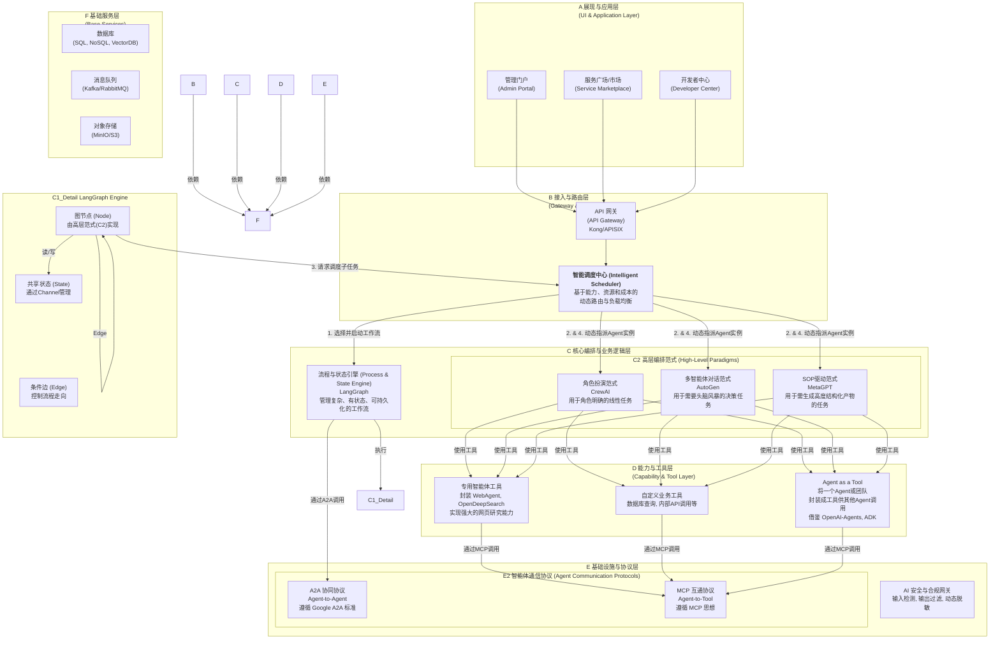
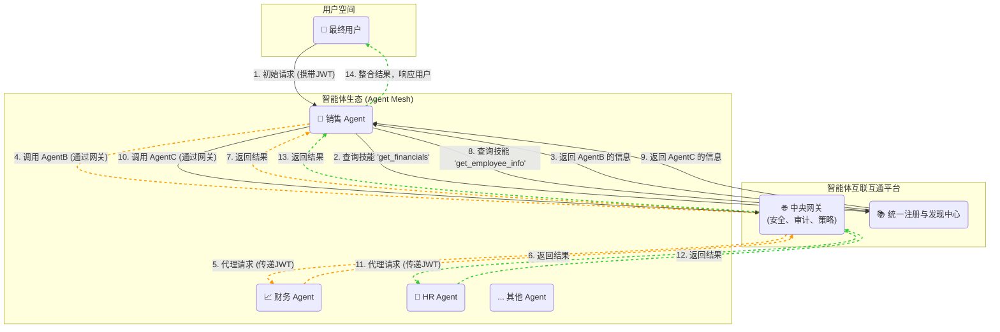

# 智能体互通平台技术方案 (V0.1.0)

## 1. 项目愿景与核心思想

### 1.1 项目背景与目标

（复用在"项目背景"和"建设目标"中的描述）

随着生成式AI技术的演进，多智能体系统（MAS）已成为企业智能化转型的关键。然而，不同厂商、平台、模型构建的智能体各自为政，导致信息孤岛、能力无法复用、安全与合规难以保障。

本项目旨在构建一个**统一、可信、安全、高效的智能体互通平台**，作为智能体应用的"操作系统"和"中枢神经"，实现智能体之间的互联互通、信任认证与协同可控，推动AI从"单体智能"迈向"协同智能"。

### 1.2 核心设计思想：分层解耦，博采众长

我们拒绝重复造轮子，也避免被单一框架锁定。正如您在技术版图报告中指出的，最佳方案是构建一个**分层解耦、各取所长**的融合架构。本方案将严格遵循此思想，以业界最优秀的开源项目作为我们不同层次的最佳实践，构建一个开放、灵活且强大的平台。

## 2. 总体技术架构

我们的架构是一个清晰的、自下而上构建的系统，确保每一层都高度内聚、职责单一。



## 3. 核心模块详细设计

### 3.1 基础设施与协议层 (Infrastructure & Protocol)

这是平台稳定运行的基石，我们采用业界标准协议来确保开放性和互操作性。

#### 3.1.1 MCP (Agent-to-Tool) 互通协议

-   **核心职责**: 定义一套标准，让平台上的任何 Agent 都能以统一、安全的方式发现和调用工具。

-   **实现机制**:
    1.  **工具即服务 (Tool as a Service)**: 借鉴 `Agent Zero` 和 `MCP-Server` 的思想，将具有潜在风险或需要独立环境的工具（如**文件读写**、**代码执行**、**Git操作**、**网页浏览**）封装成独立的、沙箱化的**微服务**。推荐使用 **Docker** 容器进行隔离。
    2.  **标准化描述 (OpenAPI v3)**: 每个工具服务必须提供一个符合 OpenAPI v3 规范的描述文件。

-   **API协议示例: `tool.json` (OpenAPI v3)**
    ```yaml
    openapi: 3.0.0
    info:
      title: 安全代码执行器 (Safe Code Executor)
      version: 1.0.0
      description: 在隔离的Docker沙箱中执行Python或Shell脚本。
    servers:
      - url: http://mcp-code-executor.service.cluster.local
    paths:
      /execute:
        post:
          summary: 执行一段代码
          operationId: executeCode
          requestBody:
            required: true
            content:
              application/json:
                schema:
                  $ref: '#/components/schemas/ExecuteRequest'
          responses:
            '200':
              description: 代码执行成功
              content:
                application/json:
                  schema:
                    $ref: '#/components/schemas/ExecuteResponse'
    components:
      schemas:
        ExecuteRequest:
          type: object
          properties:
            language:
              type: string
              enum: [python, shell]
            code:
              type: string
            timeout:
              type: integer
              default: 60
          required: [language, code]
        ExecuteResponse:
          type: object
          properties:
            stdout:
              type: string
            stderr:
              type: string
            exit_code:
              type: integer
    ```

-   **核心代码示例: 工具开发SDK (`@mcp.tool`)**
    ```python
    # mcp_sdk/decorator.py
    from fastapi import FastAPI
    from pydantic import BaseModel
    import uvicorn

    mcp_app = FastAPI()

    def tool(path: str):
        def decorator(func):
            # 自动从函数签名和类型提示生成Pydantic模型
            # ... 此处省略从func动态生成RequestModel和ResponseModel的复杂逻辑
            class RequestModel(BaseModel):
                # ...
                pass
            
            @mcp_app.post(path)
            def wrapper(request: RequestModel):
                # ... 调用原始函数 func
                result = func(**request.dict())
                return result
            
            # 自动生成OpenAPI schema并注册到工具市场
            # ...
            
            return wrapper
        return decorator

    def run_server(host="0.0.0.0", port=8000):
        uvicorn.run(mcp_app, host=host, port=port)

    # a_new_tool/main.py (开发者代码)
    # from mcp_sdk import tool, run_server
    # from pydantic import BaseModel
    #
    # class GitCloneRequest(BaseModel):
    #   repo_url: str
    #   branch: str = "main"
    #
    # @tool(path="/git_clone")
    # def git_clone(req: GitCloneRequest) -> dict:
    #   # ... 执行git clone逻辑
    #   return {"status": "success", "local_path": "/cloned_repos/..."}
    #
    # if __name__ == "__main__":
    #   run_server()
    ```

#### 3.1.2 A2A (Agent-to-Agent) 协同协议

-   **核心职责**: 定义一套标准，让平台内异构的、由不同团队开发的 Agent 能够互相发现、安全通信和协同工作。

-   **实现机制**:
    1.  **遵循 Google A2A 标准**: 采用 Google 开源的 A2A 协议作为基础，它提供了清晰的 gRPC 和 JSON-RPC 规范。
    2.  **AgentCard & 服务发现**: 平台为每个注册的 `Agent` 或 `Team` 生成唯一的DID，并托管其`AgentCard`。
    3.  **A2A网关**: 作为所有跨Agent通信的强制路由，负责**mTLS认证**、**授权**和**审计**。
    4.  **异步与流式支持**: 对于长任务，被调用方立即返回`task_id`，然后通过 **WebSocket** 或 **SSE** 推送状态。

-   **API协议示例: `AgentCard` (`/.well-known/agent.json`)**
    ```json
    {
      "a2a_version": "0.1",
      "agent_did": "did:web:our-platform.com:agent:financial-analyst-team",
      "display_name": "金融分析团队",
      "description": "提供股票分析和财务报告解读服务。",
      "signing_public_key_jwk": {
        "kty": "EC",
        "crv": "P-256",
        "x": "...",
        "y": "..."
      },
      "transport_security": "mTLS",
      "services": [
        {
          "id": "analyze_stock_v1",
          "type": "gRPC",
          "endpoint": "grpcs://a2a-gateway.our-platform.com:443/financial-analyst-team.v1.AgentService/AnalyzeStock",
          "skill_description": "分析单个股票的基本面和技术面。"
        }
      ]
    }
    ```
-   **API协议示例: A2A异步任务调用**
    *   **Request (gRPC/JSON)**: `POST /financial-analyst-team.v1.AgentService/AnalyzeStock`
        ```json
        { "stock_symbol": "ACME", "report_type": "FULL" }
        ```
    *   **Immediate Response**: `202 Accepted`
        ```json
        { "task_id": "t-12345-abcdef" }
        ```
    *   **Status Update (WebSocket/SSE)**:
        ```json
        // event: status_update
        { "task_id": "t-12345-abcdef", "status": "RUNNING", "progress": 0.3, "message": "正在获取财报..." }
        // event: result
        { "task_id": "t-12345-abcdef", "status": "SUCCESS", "result": { ...分析结果... } }
        ```

### 3.2 核心编排与业务逻辑层 (Orchestration)

这是平台的"大脑"，负责执行复杂的业务逻辑。

#### 3.2.1 智能调度中心 (Intelligent Scheduling Center)

- **核心职责**: 解决"在对的时间，把对的任务，交给对的智能体"的核心问题。它需要综合评估任务需求、智能体能力和实时资源状况，做出最优调度决策。

- **实现机制**:
    1.  **能力与状态注册**:
        *   **能力画像 (Skill Profile)**: 每个`Agent`或`Team`注册时，必须提供一份详细的`Skill Profile`，量化其在各项技能上的熟练度、响应速度、平均成本等。
        *   **实时状态监控**: 每个`Agent`实例通过**心跳机制**向调度中心实时汇报其状态（`IDLE`, `BUSY`）和当前队列长度。
    2.  **运行时动态调度**:
        *   **任务分析**: 解析任务所需的**技能要求**。
        *   **候选筛选**: 在能力注册表中检索所有具备所需技能且达标的`Agent`。
        *   **资源过滤**: 剔除所有`BUSY`的`Agent`。
        *   **最优指派**: 根据预设策略（能力最强/成本最低/负载均衡）选择一个`Agent`实例。
    3.  **与LangGraph的集成**: `LangGraph`的工作流节点不硬编码具体`Agent`，而是向调度中心发起描述性的服务请求。

-   **API协议示例: 向调度中心请求服务**
    *   **Request from LangGraph Node**: `POST /api/v1/schedule`
        ```json
        {
          "task_description": "用户希望撰写一封关于季度营销活动总结的邮件，并发送给所有部门主管。",
          "required_skills": [
            {
              "skill_name": "write_email",
              "min_proficiency": 0.85,
              "context": { "tone": "formal", "language": "zh-CN" }
            },
            {
              "skill_name": "send_email",
              "min_proficiency": 0.9
            }
          ],
          "dispatch_strategy": "best_capability", // or "lowest_cost"
          "parent_task_id": "t-000-parent-xyz"
        }
        ```
    *   **Response to LangGraph Node**: `200 OK`
        ```json
        {
          "status": "DISPATCHED",
          "agent_did": "did:web:our-platform.com:agent:expert-writer-007",
          "task_id": "t-67890-ghijk"
        }
        ```
- **核心代码示例: LangGraph节点与调度器交互**
    ```python
    # Part of a LangGraph definition
    # from our_platform_sdk import scheduler_client

    def request_email_writing_task(state: dict) -> dict:
        """A node in LangGraph that requests an expert agent to write an email."""
        
        user_request = state.get("user_request")
        
        # 向调度中心发起一个描述性的请求
        dispatch_response = scheduler_client.schedule(
            task_description=f"Write a formal email about: {user_request}",
            required_skills=[{"skill_name": "write_email", "min_proficiency": 0.85}],
            dispatch_strategy="best_capability"
        )
        
        # 等待该子任务完成 (A2A客户端内部处理了异步轮询逻辑)
        task_result = a2a_client.wait_for_task(dispatch_response['task_id'])
        
        if task_result['status'] == 'SUCCESS':
            return {"email_draft": task_result['result']['content']}
        else:
            return {"error": "Email writing failed."}

    # ... workflow.add_node("write_email", request_email_writing_task)
    ```

### 3.3 能力与工具层 (Capability & Tool)

-   **核心职责**: 为Agent提供与外部世界交互的"手臂"和"眼睛"。

-   **实现机制**:
    1.  **封装专用Agent为工具**: 将`WebAgent`、`OpenDeepSearch`等专用Agent，封装成符合MCP标准的工具。
    2.  **Agent即工具 (Agent as a Tool)**: 借鉴`OpenAI-Agents`和`ADK`的设计，提供一个`as_tool()`的辅助函数。

- **核心代码示例: `as_tool()` 适配器**
    ```python
    # platform_sdk/agent_tools.py
    from pydantic import create_model

    def as_tool(agent_or_team: object, skill_name: str) -> callable:
        """
        将一个Agent或Team的某个技能(skill)动态封装成一个可被其他Agent调用的函数(工具)。
        """
        
        # 1. 从AgentCard或Skill Profile中获取该技能的输入/输出Schema
        skill_schema = agent_or_team.get_skill_schema(skill_name)
        
        # 2. 动态创建Pydantic模型用于类型检查
        InputModel = create_model(f"{skill_name}Input", **skill_schema['input'])

        def tool_wrapper(tool_input: InputModel) -> dict:
            # 3. 在函数内部，通过A2A协议调用目标Agent
            task_id = a2a_client.call(
                agent_did=agent_or_team.did,
                skill_name=skill_name,
                payload=tool_input.dict()
            )
            result = a2a_client.wait_for_task(task_id)
            
            # 4. 返回符合Schema的结果
            return result['result']

        # 5. 为生成的函数附加描述，以便上层Agent理解其功能
        tool_wrapper.__doc__ = skill_schema['description']
        
        return tool_wrapper

    # 使用示例
    # financial_team = get_agent_by_did("did:...:financial-analyst-team")
    # analyze_stock_tool = as_tool(financial_team, "analyze_stock_v1")
    #
    # result = analyze_stock_tool(stock_symbol="ACME")
    ```

### 3.4 核心算法模块设计

本章节专门阐述平台中涉及的核心算法模型的设计，为算法团队提供清晰的研发指引。

#### 3.4.1 智能调度算法

-   **核心问题**: 当多个Agent实例具备相同技能时，如何选择"最优"的一个来执行任务。
-   **设计方案**: 采用**加权评分模型**。调度中心在收到任务后，会对所有符合技能要求的、且处于"空闲"状态的Agent实例进行评分，选择得分最高的实例。

-   **评分公式**:
    \[
    Score = w_1 \cdot P - w_2 \cdot C - w_3 \cdot L
    \]
    其中：
    *   **P (Proficiency)**: Agent在该项技能上的**熟练度** (0-1.0)。该值由`3.4.4`节的自动评估框架生成。
    *   **C (Cost)**: Agent调用一次的**成本** (归一化后的值)。代表了调用该Agent所需消耗的计算资源或API费用。
    *   **L (Load)**: Agent当前的**负载**或**队列长度** (归一化后的值)。即使Agent处于`IDLE`，也可能存在任务排队。
    *   **\(w_1, w_2, w_3\)**: **权重系数**。平台可以根据不同的调度策略（`dispatch_strategy`）动态调整权重。

-   **调度策略与权重配置**:
    *   **`best_capability` (能力优先)**: \(w_1=0.7, w_2=0.2, w_3=0.1\)。优先选择技能最强的Agent。
    *   **`lowest_cost` (成本优先)**: \(w_1=0.2, w_2=0.7, w_3=0.1\)。优先选择最经济的Agent。
    *   **`balanced` (均衡模式)**: \(w_1=0.4, w_2=0.3, w_3=0.3\)。在能力、成本和负载之间取得平衡。

#### 3.4.2 任务意图识别模型

-   **核心问题**: 在平台入口处，如何将用户输入的自然语言请求（如"帮我写个邮件总结上周的销售情况"）自动映射到平台内已定义的某个具体工作流（如`workflow:generate-sales-report-email`）。
-   **设计方案**: 使用**小参数量语言模型进行微调**，实现高效、低成本的意图分类。
    *   **模型选型**: 选择一个在中文意图分类任务上表现良好的、参数量在1B-7B之间的小模型（如 `ChatGLM3-6B`, `Qwen-7B` 或 `Yi-6B`）。
    *   **训练数据**: 需要标注一批`"用户请求文本" -> "工作流ID"`的数据对。在项目初期，可以由人工标注数百条，后期可通过用户实际使用日志不断扩充。
    *   **输出格式**: 模型的输出被强制约束为JSON格式，直接给出工作流ID和提取出的核心参数。
        *   **输入Prompt**: `"请分析以下用户请求，并将其分类到最合适的工作流ID。用户请求：'帮我研究一下特斯拉最近的股价和新闻'"。`
        *   **期望输出 (JSON)**: `{"workflow_id": "market_research", "entities": {"company": "特斯拉", "topic": "股价和新闻"}}`

#### 3.4.3 AI安全与合规模型

-   **核心问题**: 如何检测和过滤Agent输入/输出中的不当内容，以及如何防止敏感信息泄露。
-   **设计方案**: 采用**模型组合拳**，分层处理。
    1.  **内容安全分类器**:
        *   **技术**: 这是一个**多标签文本分类模型**，可以基于`BERT`等预训练模型进行微调。
        *   **标签**: `prompt_injection` (提示词注入), `harmful_content` (暴力、色情等有害内容), `policy_violation` (违反平台规定), `ethics_risk` (伦理风险)等。
        *   **应用**: 在AI安全网关处，对所有流入和流出LLM的流量进行实时检测。
    2.  **PII动态脱敏模型**:
        *   **技术**: 使用**命名实体识别 (NER)**模型。
        *   **实体类型**: `PERSON` (人名), `PHONE` (电话), `EMAIL` (邮箱), `ID_CARD` (身份证), `ADDRESS` (地址)等。
        *   **应用**: 模型识别出PII实体后，系统会用占位符（如`[PHONE]`）替换原文，并将原文与占位符的映射关系存入一个安全的、临时的内存数据库中（如Redis），仅供本次任务流中的授权Agent访问。任务结束后，该映射关系立即销毁。

#### 3.4.4 Agent能力自动评估框架

-   **核心问题**: 如何客观、可量化、自动化地评估一个Agent在某项技能上的熟练度（Proficiency），以支撑智能调度。
-   **设计方案**: 构建一个基于"**基准测试+LLM裁判**"的自动化评估流水线。
    1.  **建立技能基准库 (Skill Benchmark Repository)**:
        *   为平台支持的每一种核心技能（如`write_code`, `analyze_data`, `summarize_text`），由专家定义一个包含N个标准任务的**基准测试集**（以JSON格式存储）。
        *   每个任务包含`task_input`（任务描述）和`evaluation_criteria`（评估标准，描述了"好"的输出应该具备哪些特征）。
    2.  **自动化评估流水线**:
        *   当一个新Agent注册或更新某项技能时，平台自动触发此流水线。
        *   流水线遍历该技能对应的基准测试集中的所有任务，让待评估的Agent执行。
        *   对于每个任务的产出，系统会调用一个强大的"**裁判LLM**"（如`GPT-4o`或`Claude 3 Opus`）。
    3.  **LLM裁判进行打分**:
        *   **裁判Prompt模板**:
            ```
            # ROLE
            You are an impartial and strict AI assistant evaluator.
            
            # TASK
            Evaluate the provided `SUBMISSION` based on the `EVALUATION_CRITERIA`. Score it from 0.0 to 1.0.
            
            # EVALUATION_CRITERIA
            {{evaluation_criteria}}
            
            # SUBMISSION
            {{agent_output}}
            
            # RESPONSE FORMAT
            Return a JSON object with two keys: "score" (float) and "justification" (string).
            ```
        *   系统收集所有任务的得分，通过加权平均（可根据任务难度设置权重）计算出该Agent在该项技能上的最终**熟练度P**，并写入其能力画像。

## 4. 实施路径与时间规划 (1年期)

我们将项目分为四个主要阶段，每个阶段为期一个季度，总计 **12个月** 完成平台的核心功能建设与初步推广。

---

### **第一阶段：地基与核心协议 (Months 1-3)**

*   **目标**: 搭建平台的骨架，定义好"游戏规则"，让Agent和工具可以"说话"。
*   **"做什么"**:
    *   **Month 1**: 基础设施搭建（K8s, DB, Gateway）；协议草案初稿（MCP & A2A）；**算法需求与基准测试集（v0.1）研讨**。
    *   **Month 2**: 协议规范v1.0定稿；MCP/A2A SDK v0.5开发；统一身份与权限中心v1.0。
    *   **Month 3**: MCP/A2A SDK v1.0发布并撰写文档；开发并交付第一个MCP工具服务（**安全文件操作**）。
*   **"如何做"**:
    *   DevOps团队负责基础设施。
    *   架构师和核心开发团队主导协议设计和SDK开发，需密集评审。
    *   **算法团队启动技术预研，并与业务方共同定义核心技能的评估标准**。
    *   开发团队实现标杆工具服务，并使用SDK验证。
*   **交付成果**: 一套可用的Agent和Tool的通信标准和开发库；一个可运行的工具微服务；一个身份管理中心；**一份明确的算法需求文档和初步的技能基准库**。

---

### **第二阶段：编排引擎与核心能力 (Months 4-6)**

*   **目标**: 构建平台的"大脑"和"双手"，让Agent可以"思考"和"行动"。
*   **"做什么"**:
    *   **Month 4**: `LangGraph`引擎集成，完成与数据库的Checkpointer持久化对接。
    *   **Month 5**: 在`LangGraph`之上构建`CrewAI`风格的高层抽象层；开发**安全代码执行**和**网页浏览**核心MCP工具集。
    *   **Month 6**: 开发`A2A Gateway` v1.0；**算法团队交付意图识别模型v1.0和内容安全分类器v1.0**；开发**智能调度中心 v0.5**（实现基于能力画像的静态路由）。
*   **"如何做"**:
    *   核心开发团队负责`LangGraph`集成和`CrewAI`抽象层，是本阶段技术难点。
    *   **算法团队负责训练和部署意图识别与内容安全模型，并与后端集成**。
    *   应用开发团队并行开发核心工具服务。
    *   安全和网络团队协助`A2A Gateway`开发。
*   **交付成果**: 一个可执行、可持久化的工作流引擎；一套核心工具；Agent间可安全通信；**一个集成了初步AI能力的、可进行静态调度的平台**。

---

### **第三阶段：平台服务与智能进化 (Months 7-9)**

*   **目标**: 将平台的能力"产品化"，让调度变得"智能"，并构建一个完整的示例来证明其价值。
*   **"做什么"**:
    *   **Month 7**: **智能调度中心 v1.0** 开发，**算法团队交付加权评分调度算法v1.0**，并与调度器后端集成，实现动态负载均衡。
    *   **Month 8**: 建设可视化的**工具市场 v1.0**；开发**AI安全网关 v1.0**（集成PII脱敏模型）；启动端到端Showcase开发。
    *   **Month 9**: 完成Showcase：**"自动化市场研究报告生成器"**；**算法团队完成Agent能力自动评估框架v1.0的开发与测试**。
*   **"如何做"**:
    *   产品和前端团队介入，设计和开发工具市场的UI。
    *   **算法团队负责智能调度算法、PII模型以及能力评估框架的研发，这是本阶段的算法侧重点**。
    *   全栈应用开发团队负责Showcase开发，作为对前期所有成果的全面检验。
*   **交付成果**: 一个具备动态调度能力的平台；一个可视化的工具市场；**一个拥有自动化Agent评估能力的平台**；一个令人印象深刻的应用案例。

---

### **第四阶段：管理运维与生态建设 (Months 10-12)**

*   **目标**: 让平台变得可管理、可运营，并为开发者提供良好的生态支持，准备正式上线。
*   **"做什么"**:
    *   **Month 10**: 开发**管理门户 v1.0**，供平台管理员监控平台状态、管理用户、审查Agent和工具。
    *   **Month 11**: 建设**开发者中心**，提供完善的开发者文档、SDK使用指南、API参考和快速开始教程；完成**可观测性**系统（Logging, Tracing, Metrics）的深度对接。
    *   **Month 12**: 进行平台压力测试和安全审计；**对所有算法模型进行性能优化和迭代**；准备v1.0发布材料；规划下一年度的路线图。
*   **"如何做"**:
    *   前端和后端团队协作开发管理门户。
    *   开发者关系/技术写作团队负责开发者中心的建设。
    *   **SRE/运维团队与算法团队**负责可观测性系统对接、压测和模型性能优化。
*   **交付成果**: 一个可运营、可维护、对开发者友好的企业级智能体互通平台v1.0。

## 五、网状协作模式：实现"智能体即入口"

为了实现"每个智能体都是入口，也都能成为调用者"的网状协作（Agent Mesh）目标，平台需提供一套完整的支撑体系，确保智能体之间可以动态发现、安全通信、协同工作。

### 5.1 核心架构

该模式的核心思想是：任何智能体接收到其自身无法独立完成的复杂请求时，能够通过平台提供的基础设施，安全、动态地发现并编排网络中其他智能体的能力，共同完成任务。所有跨智能体的调用都由中央网关代理，以实现统一的治理和监控。



### 5.2 五大实现支柱

1.  **统一智能体注册与发现中心**: 平台的"黄页"，所有智能体在此注册其能力（`AgentCard`）。使得任何 Agent 都能动态发现其他 Agent 的技能。
2.  **标准化 A2A 通信协议**: 智能体间沟通的"普通话"，基于 A2A 协议（JSON-RPC/gRPC）实现彻底解耦。
3.  **联邦身份的无缝传递**: 保障端到端安全的"数字护照"，用户的 JWT 在整个调用链中被安全传递，确保每个环节的操作都有据可查、权限可控。
4.  **智能体自身的"工具化"调用能力**: 每个智能体的"大脑"，通过平台提供的 SDK，将其他智能体的技能无缝包装为自身 LLM 可用的工具，极大降低了编排开发的复杂性。
5.  **中央网关与策略执行**: 生态系统的"交通警察"，所有 A2A 调用必须通过网关代理，以实现集中的安全审计、日志追踪、熔断限流和循环调用检测等高级治理功能。

## 六、实施路径与时间规划 (1年期)

我们将项目分为四个主要阶段，每个阶段为期一个季度，总计 **12个月** 完成平台的核心功能建设与初步推广。

---

### **第一阶段：地基与核心协议 (Months 1-3)**

*   **目标**: 搭建平台的骨架，定义好"游戏规则"，让Agent和工具可以"说话"。
*   **"做什么"**:
    *   **Month 1**: 基础设施搭建（K8s, DB, Gateway）；协议草案初稿（MCP & A2A）；**算法需求与基准测试集（v0.1）研讨**。
    *   **Month 2**: 协议规范v1.0定稿；MCP/A2A SDK v0.5开发；统一身份与权限中心v1.0。
    *   **Month 3**: MCP/A2A SDK v1.0发布并撰写文档；开发并交付第一个MCP工具服务（**安全文件操作**）。
*   **"如何做"**:
    *   DevOps团队负责基础设施。
    *   架构师和核心开发团队主导协议设计和SDK开发，需密集评审。
    *   **算法团队启动技术预研，并与业务方共同定义核心技能的评估标准**。
    *   开发团队实现标杆工具服务，并使用SDK验证。
*   **交付成果**: 一套可用的Agent和Tool的通信标准和开发库；一个可运行的工具微服务；一个身份管理中心；**一份明确的算法需求文档和初步的技能基准库**。

---

### **第二阶段：编排引擎与核心能力 (Months 4-6)**

*   **目标**: 构建平台的"大脑"和"双手"，让Agent可以"思考"和"行动"。
*   **"做什么"**:
    *   **Month 4**: `LangGraph`引擎集成，完成与数据库的Checkpointer持久化对接。
    *   **Month 5**: 在`LangGraph`之上构建`CrewAI`风格的高层抽象层；开发**安全代码执行**和**网页浏览**核心MCP工具集。
    *   **Month 6**: 开发`A2A Gateway` v1.0；**算法团队交付意图识别模型v1.0和内容安全分类器v1.0**；开发**智能调度中心 v0.5**（实现基于能力画像的静态路由）。
*   **"如何做"**:
    *   核心开发团队负责`LangGraph`集成和`CrewAI`抽象层，是本阶段技术难点。
    *   **算法团队负责训练和部署意图识别与内容安全模型，并与后端集成**。
    *   应用开发团队并行开发核心工具服务。
    *   安全和网络团队协助`A2A Gateway`开发。
*   **交付成果**: 一个可执行、可持久化的工作流引擎；一套核心工具；Agent间可安全通信；**一个集成了初步AI能力的、可进行静态调度的平台**。

---

### **第三阶段：平台服务与智能进化 (Months 7-9)**

*   **目标**: 将平台的能力"产品化"，让调度变得"智能"，并构建一个完整的示例来证明其价值。
*   **"做什么"**:
    *   **Month 7**: **智能调度中心 v1.0** 开发，**算法团队交付加权评分调度算法v1.0**，并与调度器后端集成，实现动态负载均衡。
    *   **Month 8**: 建设可视化的**工具市场 v1.0**；开发**AI安全网关 v1.0**（集成PII脱敏模型）；启动端到端Showcase开发。
    *   **Month 9**: 完成Showcase：**"自动化市场研究报告生成器"**；**算法团队完成Agent能力自动评估框架v1.0的开发与测试**。
*   **"如何做"**:
    *   产品和前端团队介入，设计和开发工具市场的UI。
    *   **算法团队负责智能调度算法、PII模型以及能力评估框架的研发，这是本阶段的算法侧重点**。
    *   全栈应用开发团队负责Showcase开发，作为对前期所有成果的全面检验。
*   **交付成果**: 一个具备动态调度能力的平台；一个可视化的工具市场；**一个拥有自动化Agent评估能力的平台**；一个令人印象深刻的应用案例。

---

### **第四阶段：管理运维与生态建设 (Months 10-12)**

*   **目标**: 让平台变得可管理、可运营，并为开发者提供良好的生态支持，准备正式上线。
*   **"做什么"**:
    *   **Month 10**: 开发**管理门户 v1.0**，供平台管理员监控平台状态、管理用户、审查Agent和工具。
    *   **Month 11**: 建设**开发者中心**，提供完善的开发者文档、SDK使用指南、API参考和快速开始教程；完成**可观测性**系统（Logging, Tracing, Metrics）的深度对接。
    *   **Month 12**: 进行平台压力测试和安全审计；**对所有算法模型进行性能优化和迭代**；准备v1.0发布材料；规划下一年度的路线图。
*   **"如何做"**:
    *   前端和后端团队协作开发管理门户。
    *   开发者关系/技术写作团队负责开发者中心的建设。
    *   **SRE/运维团队与算法团队**负责可观测性系统对接、压测和模型性能优化。
*   **交付成果**: 一个可运营、可维护、对开发者友好的企业级智能体互通平台v1.0。

## 七、数据合规与安全设计

在智能体（Agent）系统中，尤其是在涉及 A2A（Agent-to-Agent）通信和 MCP（Model Context Protocol）工具调用的复杂场景下，数据合规与安全是保障系统可信、可用的生命线。本章节将深入分析这两类交互模式带来的合规挑战，并提出一套完整的设计方案。

### 7.1 合规挑战分析

通过对 A2A 和 MCP 协议的分析，我们识别出以下核心合规挑战：

1.  **数据主权与跨域流转**：在 A2A 网络中，数据可能在不同信任域的 Agent 间流转。在 MCP 架构下，Agent 可能通过 `filesystem` 或 `git` 等工具访问本地敏感数据，引发数据所有权和管辖权问题。
2.  **访问控制粒度粗**：A2A 和 MCP 的原生设计侧重于功能实现，缺乏与最终用户身份绑定的、细粒度的权限控制。一个 Agent 是否能调用另一个 Agent 的敏感技能，或者一个模型是否有权修改某个文件，需要明确的授权机制。
3.  **数据传输与存储风险**：Agent 间的通信、Agent 与工具的交互，以及 `MCP memory` 服务产生的知识图谱，都涉及数据的传输和持久化存储。若未加密，存在被窃听、篡改或泄露的风险。
4.  **敏感信息泄露**：用户与 Agent 的对话、Agent 的思考过程（如 MCP 的 `sequentialthinking`）、调用工具的参数，都可能包含个人身份信息（PII）或其他业务敏感数据。
5.  **审计与追溯困难**：在复杂的分布式调用链中，如果缺乏统一的日志和追踪标准，一旦发生安全事件或数据泄露，将难以追溯责任、定位源头。

### 7.2 安全合规方案

为应对上述挑战，我们设计了以下贯穿整个智能体网关和执行引擎的安全与合规体系。

#### 7.2.1 统一身份与访问管理 (IAM)

采用"用户身份代理"模式，将所有操作权限与终端用户身份绑定。这套体系的核心是**联邦身份认证（Federated Identity）**模型，确保平台颁发的统一身份能被所有第三方智能体安全地识别与信任。

-   **身份提供商 (IdP)**: 我们的平台充当中央 IdP，基于 **OpenID Connect (OIDC)** 协议栈。负责管理用户身份、认证用户并签发包含身份和授权信息的 **ID Token** 和 **Access Token** (均为 JWT 格式)。
-   **服务提供商 (SP)**: 所有外部接入的智能体（无论是 A2A 还是 MCP 服务）都作为 SP/资源服务器。它们本身不处理用户密码，其唯一职责是验证平台 IdP 签发的 JWT 签名的合法性。

**具体流程与实现**：
1.  **Agent 注册与信任建立**: 第三方 Agent 的开发者在我们的平台上注册其服务。平台会为其分配 `client_id`，并告知用于验证 JWT 签名的公钥端点（JWKS URI）。这是建立信任联邦的基石。
2.  **用户认证与令牌颁发 (OIDC 授权码流程)**: 为了实现跨应用的单点登录（SSO），系统严格遵循 OIDC 的授权码流程。
    *   **首次登录**: 用户访问任一 Agent 时，若未认证，将被重定向至平台的**统一登录页面**完成身份验证。
    *   **单点登录与同意授权**: 当用户已登录平台，并尝试通过 Agent B 访问 Agent A 的受保护资源时，平台将作为中介：
        a. Agent B 将用户重定向至平台的**授权端点**。
        b. 平台识别出用户已登录，**跳过密码验证**，直接向用户展示**同意授权页面**（Consent Screen），请求用户授权 Agent B 代表其访问 Agent A。
        c. 用户同意后，平台通过重定向将**授权码**安全地传递给 Agent A。
        d. Agent A 在后端用此授权码向平台换取 Access Token，从而在不接触用户密码的情况下，安全地完成了对用户的身份认证和授权。
3.  **携带令牌调用**: 客户端（或代表用户的网关）在调用外部 Agent 的 A2A/MCP 接口时，必须在 HTTP `Authorization` 头中以 `Bearer` 方式携带该 JWT。
4.  **Agent 验证并授权**: 外部 Agent 收到请求后，必须：
    *   通过 JWKS URI 获取 IdP 公钥，**验证 JWT 签名**的合法性。
    *   **校验 JWT 的声明 (Claims)**，如签发者 `iss`、受众 `aud`、过期时间 `exp`。
    *   验证通过后，从 JWT 的 `sub` 声明中获取用户的**平台统一 ID**，并根据 `scope` 声明判断其权限，从而完成授权。

#### 7.2.2 全生命周期数据加密

确保数据在传输和存储过程中的机密性。

-   **传输加密**: 所有 Agent 之间、Agent 与 MCP 服务之间的 HTTP 通信，强制启用 **mTLS (双向 TLS)**。这确保了只有受信任的、持有有效客户端证书的服务才能接入通信网络。
-   **存储加密**:
    -   **Agent 记忆加密**: 对 MCP `memory` 服务或类似 Agent 记忆模块产生的持久化文件（如知识图谱），在写入磁盘前进行应用层加密。密钥由独立的密钥管理服务（KMS）托管。
    -   **任务数据加密**: A2A 交互中持久化的任务（Tasks）和产物（Artifacts）在存入数据库时，启用数据库层的透明数据加密（TDE）。
    -   **凭证安全**: 严禁在代码或配置文件中明文存储密码、API 密钥等。所有敏感凭证应存放在专业的凭证管理系统（如 HashiCorp Vault）中，由应用在运行时动态获取。

#### 7.2.3 细粒度数据沙箱与脱敏

实现最小权限原则，防止数据滥用和泄露。

-   **动态沙箱 (Dynamic Sandboxing)**: MCP `filesystem` 服务的可访问目录不应是静态配置的，而应根据发起请求用户的 JWT 中携带的身份和项目上下文，在运行时动态生成。这确保了 Agent 的文件访问权限被严格限制在当前任务所需的最狭窄范围内。
-   **数据脱敏网关 (Data Masking Gateway)**: 在系统的总入口（如API网关）或数据交换的关键节点，部署一个数据脱敏服务。该服务基于正则表达式和 NLP 模型，自动识别和屏蔽请求/响应中的个人身份信息（PII）和其他预定义的敏感数据，从源头切断敏感信息的非必要流转。

#### 7.2.4 全链路审计与可追溯性

建立无死角的监控和审计能力，满足合规审查要求。

-   **分布式追踪 (Distributed Tracing)**: 全面拥抱 OpenTelemetry 标准。为用户的每个初始请求生成唯一的 **Trace ID**，并确保该 ID 贯穿整个调用链，包括所有 A2A 调用和 MCP 工具执行。
-   **结构化审计日志**: 要求所有 Agent 和 MCP 服务输出统一格式的结构化日志（JSON）。日志内容必须包含 `Trace ID`、时间戳、用户身份、源/目标服务、操作详情、输入/输出（脱敏后）以及执行结果。
-   **中央日志平台**: 将所有审计日志实时采集到中央日志系统（如 ELK、Splunk）。在此平台上配置监控仪表盘和告警规则，实现对异常行为的实时检测和事后追溯分析。
