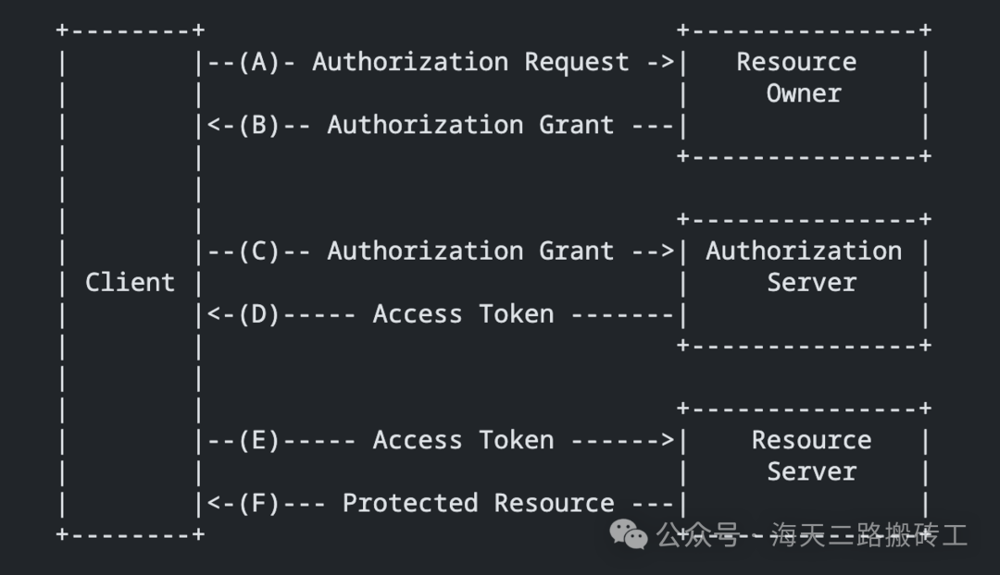
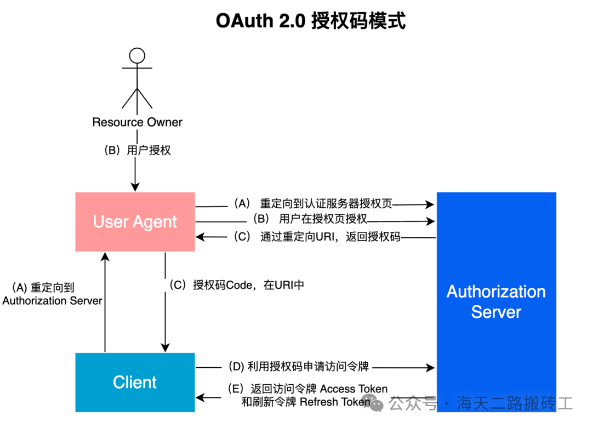
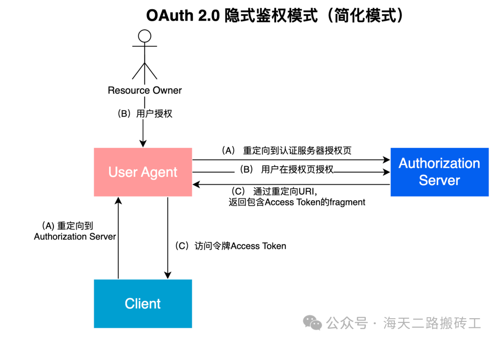

# 深入理解OAuth 2.0：原理、流程与实践
原文链接: https://cloud.tencent.com/developer/article/2418791

### **一、什么是OAuth 2.0**

#### **1. 什么是OAuth 2.0**

OAuth 2.0 是一套关于**授权**的行业标准协议。

OAuth 2.0 允许用户授权第三方应用访问他们在另一个服务提供方上的数据，而无需分享他们的凭据（如用户名、密码）。

#### **2. OAuth 2.0 应用场景**

OAuth 2.0的应用场景非常广泛，包括但不限于：

* 第三方应用访问用户在其他服务上的信息，例如，一个应用通过OAuth 2.0访问用户在github.com上的数据。
* 第三方应用代表用户执行操作，例如，一个邮件客户端应用通过OAuth 2.0发送用户的电子邮件。
* 第三方应用使用OAuth 2.0实现用户的单点登录，例如，用户可以使用Github账号登录其他应用。

#### **3. OAuth 2.0 的重要性**

OAuth 2.0的重要性主要体现在它以简洁、易实现的解决方案，解决用户数据访问和分享的安全问题的。

* 在现代网络环境中，用户的数据通常分散在不同的网络服务中，如何安全、有效地进行数据访问和分享，是一个重要的问题。OAuth 2.0提供了一种标准的解决方案，使得用户可以控制哪些应用可以访问他们的哪些数据，而无需将用户名和密码提供给第三方应用。

### **二、OAuth 2.0 基本概念**

OAuth2.0 的运行流程中，会涉及到一些名词、概念，熟悉这些名词、概念有助于更好的理解OAuth 2.0 机制

* **客户端（Client）：**
  请求访问资源的第三方应用；客户端可以是Web站点、App、设备等。
* **服务提供商（Service Provider）：**
  服务提供商是指提供、存放资源的网络服务，如Google、Github等；
* **资源所有者（Resource Owner）：**
  资源所有者通常就是指用户，他们拥有服务提供商上的资源。
* **授权服务器（Authorization Server）：**
  授权服务器是服务提供商用于处理和发放访问令牌的服务器。当用户请求访问资源时，需要先向授权服务器请求访问令牌。
* **资源服务器（Resource Server）：**
  资源服务器是服务提供商用于存储和管理资源的服务器；当用户拥有访问令牌后，就可以向资源服务器请求访问资源。
* **访问令牌（Access Token）：**
  访问令牌是授权服务器发放给客户端的一个凭证，表示客户端有权访问资源所有者的资源。访问令牌有一定的有效期，过期后需要使用刷新令牌来获取新的访问令牌。
* **刷新令牌（Refresh Token）：**
  刷新令牌是授权服务器在发放访问令牌时一同发放的一个凭证，用于在访问令牌过期后获取新的访问令牌。刷新令牌通常有较长的有效期，甚至可以设置为永不过期。
* 用户代理（User Agent）：
  通常指浏览器。

#### **三、OAuth 2.0 的基本流程**

RFC 6749 中定义了OAuth 2.0 的运行流程

* （A）客户端（Client）向资源所有者（Resource Owner）请求资源授权。授权请求可以直接向资源所有者（Resource Owner）发起，不过最好是通过授权服务器（Authorization Server）间接发起。
* （B) 客户端（Client）得到资源所有者（Resoure Owner）的授权，这通常是一个凭据；授权的形式和凭据可以有不同的类型。RFC 6749 定义了四种主要的授权类型（下文进一步介绍）
* （C）客户端（Client）向授权服务器（Authorization Server）出示授权（来自Resource Owenr的）凭据进行身份认证；并申请用于访问资源授权的访问令牌（Access Token）
* （D) 授权服务器（Authorization Server）对客户端（Client）进行身份验证并验证授权授予，如果通过验证，则颁发访问令牌（Access Token）。
* （E）客户端（Client）通过向资源服务器（Resource Server）发起令牌（Access Token）验证，请求被保护的资源。
* （F）资源服务器（Resource Server)验证访问令牌（Access Token）；如果通过认证，则返回请求的资源。

### **四、四种授权模式**

客户端必须得到用户的授权（前面的步骤B），才能获得访问令牌（Access Token）。

OAuth 2.0定义了四种授权方式。

* 授权码模式（Authorization Code）
* 隐式授权模式（Implicit）
* 密码模式（Resource Owner Password Credentials）
* 客户端模式（Client Credentials）

#### **1. 授权码模式**

授权码模式是最常用的授权流程。也是功能最完整、流程最严密的授权模式。

下图是授权码模式中OAuth 2.0 授权流程（上文OAuth 2.0 的步骤B）的展开

* （A）Client先将页面重定向Authorization Server的授权页；重定向是需要携带授权完毕后要重新打开的页面（携带RedirectURI）。
* （B）Resource Owner在授权也进行授权。
* （C）授权后，Authorization Server将页面重定向会Client的页面（在A步骤中指定的RedirectURI）。同时会在URI中携带授权码Code。授权码Code会经UserAgent最终传递给Client的后端。
* （D）Client（后端）利用授权码向Authorization Server请求访问令牌（Access Token），这里需要指定请求访问的访问Scope等信息。
* （E）Authorization Server 校验授权码通过后，返回访问令牌Access Token和刷新令牌Refresh Token。

#### **2. 隐式授权模式（Implicit）**

隐式授权模式主要用于纯前端应用，如JavaScript SPA（单页应用）。

在隐式授权模式中，不是向客户端颁发授权码，而是直接向客户端颁发访问令牌（作为资源所有者授权的结果）。省去了颁发中间凭据（例如授权代码）的过程。

* （A）用户代理（通常是浏览器）向认证服务器发送授权请求。这通常通过将用户重定向到认证服务器的授权端点来完成，请求中包含了客户端ID、请求的权限范围、重定向URI和状态。
* （B） 认证服务器对用户进行身份验证，通常是通过要求用户输入用户名和密码。认证服务器向用户显示一个授权页面，让用户决定是否授予客户端请求的权限。
* （C）如果用户同意授予权限，认证服务器将用户代理重定向回客户端的重定向URI，并在重定向URI的片段部分（fragment）中包含访问令牌和状态。注意，由于这是在用户代理中完成的，所以访问令牌从未通过服务器端的应用代码。

#### **3. 密码模式（Resource Owner Password Credentials）**

密码模式是一种较为简单的流程，用户直接将用户名和密码提供给客户端，客户端使用这些信息向授权服务器请求访问令牌。客户端不得存储密码。

密码模式主要用于信任级别较高的应用，如同一公司的不同产品。

* （A） 用户在客户端应用中输入他们的用户名和密码。
* （B） 客户端应用使用用户提供的用户名和密码，以及自己的客户端ID和客户端密钥，向认证服务器的令牌端点发送请求，请求获取访问令牌。
* （C）认证服务器验证用户名和密码，以及客户端ID和客户端密钥。如果验证成功，认证服务器将访问令牌返回给客户端应用。

#### **4. 客户端模式（Client Credentials）**

客户端模式主要用于没有用户参与的后端服务（如开放API的场景）。

* （A）客户端应用程序使用自己的客户端ID和客户端密钥，向认证服务器的令牌端点发送请求，请求获取访问令牌。
* （B） 认证服务器验证客户端ID和客户端密钥。如果验证成功，认证服务器将访问令牌返回给客户端应用程序。

### **五、OAuth 2.0的安全性考虑**

1. 重定向URI的安全性 重定向URI是客户端接收授权码和访问令牌的地址。为了防止攻击者拦截这些敏感信息，重定向URI应该使用HTTPS协议。此外，授权服务器应该只接受预先注册的重定向URI，以防止攻击者将用户重定向到恶意网站。
2. 访问令牌的保护 访问令牌是一个敏感的凭证，如果被攻击者获取，他们就可以访问用户的资源。因此，访问令牌应该在所有传输过程中使用HTTPS协议进行加密，防止被窃听。在存储访问令牌时，也应该使用适当的加密措施进行保护。
3. 刷新令牌的使用和保护 刷新令牌通常有较长的有效期，甚至可以设置为永不过期。因此，如果刷新令牌被攻击者获取，他们就可以持续访问用户的资源。为了防止这种情况，刷新令牌应该只在后端服务中使用，不应该暴露给前端应用。此外，刷新令牌也应该在所有传输和存储过程中进行加密保护。
4. CSRF攻击和防范 CSRF（跨站请求伪造）是一种常见的网络攻击，攻击者通过伪造用户的请求来执行未经授权的操作。为了防止CSRF攻击，OAuth 2.0的授权请求可以包含一个state参数，这是一个随机生成的字符串，用于在授权服务器重定向回客户端时验证请求的合法性。客户端在发送授权请求时生成state参数，并在接收授权响应时验证它，如果不匹配，就拒绝响应。

### **六、OAuth 2.0的实践**

#### **1. 使用OAuth 2.0进行第三方登录**

第三方登录是OAuth 2.0的一个常见应用场景。用户可以使用他们在Google，Facebook等服务提供商上的账号，直接登录第三方应用，无需注册新的账号。这不仅提高了用户体验，也降低了用户忘记密码的风险。

#### **2. 使用OAuth 2.0进行API授权**

OAuth 2.0也常用于API授权。例如，一个应用可以请求访问用户在Google Drive上的文件，或者请求发布微博到用户的Twitter账号。在这些情况下，用户可以使用OAuth 2.0授权应用访问他们的资源，而无需将用户名和密码提供给应用。

#### **3. 常见问题和解决方案**

在实践OAuth 2.0时，可能会遇到一些问题，例如重定向URI的匹配问题，访问令牌的过期问题，刷新令牌的使用问题等。这些问题通常可以通过正确配置授权服务器和客户端，以及遵循OAuth 2.0的最佳实践来解决。例如，可以使用绝对匹配而不是模糊匹配来验证重定向URI，可以使用刷新令牌来获取新的访问令牌，而不是让用户重新登录等。